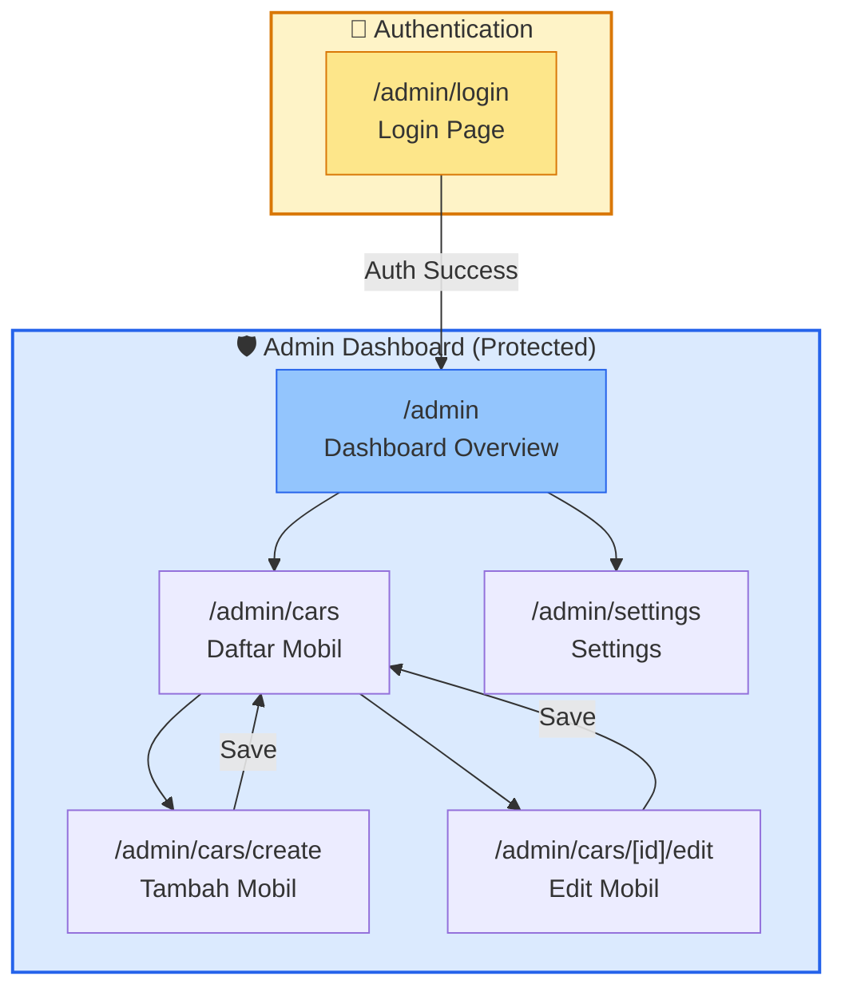
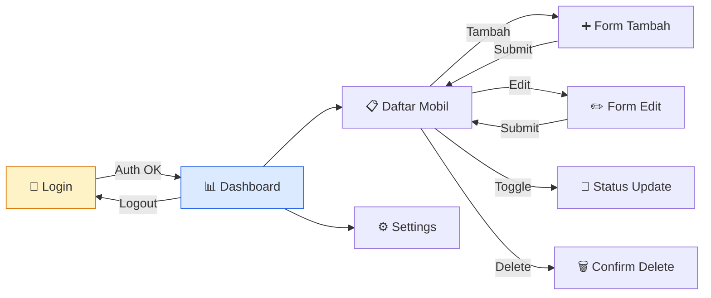
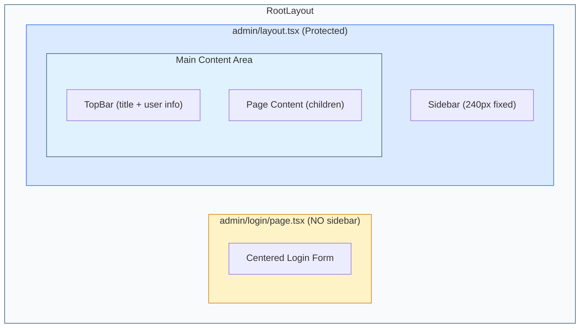
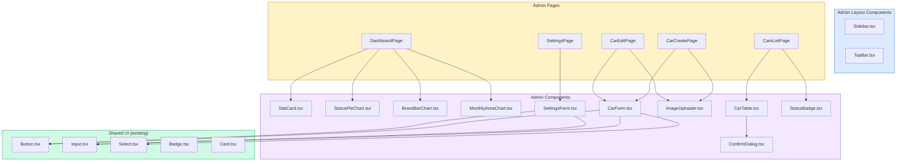
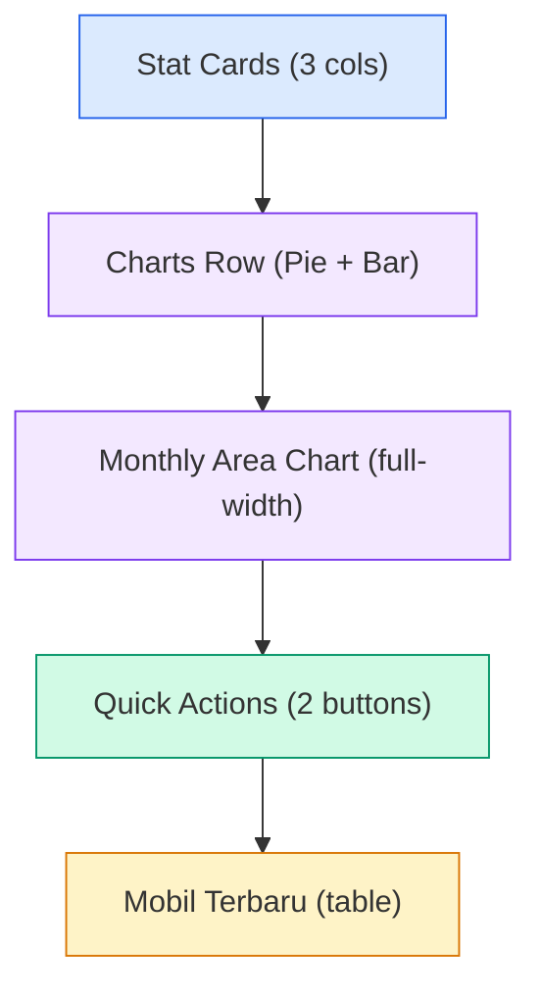
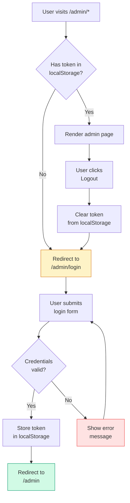

# 🔒 Implementation Plan — Admin Dashboard Frontend

Referensi: [Implementation Plan Frontend (Global)](file:///d:/Coding/garasirumahan-laravel1/implementation_plan_frontend_all.md) | [PRD](file:///d:/Coding/garasirumahan-laravel1/PRD.md)

---

## 1. Scope & Overview

Admin Dashboard terdiri dari **Login Page** + **4 halaman utama** di dalam layout sidebar:

```
1. Login Page (standalone, tanpa sidebar)
2. Dashboard Overview (stat cards + charts + quick actions)
3. Daftar Mobil (table + search + filter status)
4. Tambah/Edit Mobil (form + image upload)
5. Settings (info showroom form)
```

---

## 2. Arsitektur Navigasi Admin

### 2.1 Sitemap Admin



### 2.2 User Flow Admin



### 2.3 Layout Architecture



### 2.4 Component Hierarchy



---

## 3. Files to Create

### Execution Order

| # | File | Type | Deskripsi |
|---|------|------|-----------|
| 1 | `src/lib/types.ts` | Types | Tambah `User`, `AuthState` interface |
| 2 | `src/lib/mock-data.ts` | Data | Tambah mock admin user |
| 3 | `src/components/ui/Textarea.tsx` | UI | Textarea component |
| 4 | `src/components/ui/Modal.tsx` | UI | Confirm dialog / modal |
| 5 | `src/components/admin/Sidebar.tsx` | Component | Admin sidebar navigation |
| 6 | `src/components/admin/TopBar.tsx` | Component | Admin top bar |
| 7 | `src/components/admin/StatCard.tsx` | Component | Dashboard stat card |
| 8 | `src/components/admin/StatusPieChart.tsx` | Component | Pie chart status distribusi |
| 9 | `src/components/admin/BrandBarChart.tsx` | Component | Bar chart per brand |
| 10 | `src/components/admin/MonthlyAreaChart.tsx` | Component | Area chart mobil per bulan |
| 11 | `src/components/admin/StatusBadge.tsx` | Component | Available/Sold badge |
| 12 | `src/components/admin/CarTable.tsx` | Component | Cars data table |
| 13 | `src/components/admin/CarForm.tsx` | Component | Create/Edit car form |
| 14 | `src/components/admin/ImageUploader.tsx` | Component | Multi image upload |
| 15 | `src/components/admin/SettingsForm.tsx` | Component | Settings form |
| 16 | `src/components/admin/ConfirmDialog.tsx` | Component | Delete confirmation |
| 17 | `src/app/admin/login/page.tsx` | Page | Login page |
| 18 | `src/app/admin/layout.tsx` | Layout | Admin layout (sidebar + topbar) |
| 19 | `src/app/admin/page.tsx` | Page | Dashboard overview |
| 20 | `src/app/admin/cars/page.tsx` | Page | Daftar mobil |
| 21 | `src/app/admin/cars/create/page.tsx` | Page | Tambah mobil |
| 22 | `src/app/admin/cars/[id]/edit/page.tsx` | Page | Edit mobil |
| 23 | `src/app/admin/settings/page.tsx` | Page | Settings |

---

## 4. Page Detail & Wireframes

### 4.1 Login Page (`/admin/login`)

```
Desktop & Mobile:
┌──────────────────────────────────────────────────┐
│             bg: --soft-bg (#F8FAFC)              │
│                                                  │
│         ┌────────────────────────┐               │
│         │   🚗 GARASIRUMAHAN     │               │
│         │   Admin Panel          │               │
│         │                        │               │
│         │   Email                │               │
│         │   ┌──────────────────┐ │               │
│         │   │                  │ │               │
│         │   └──────────────────┘ │               │
│         │                        │               │
│         │   Password             │               │
│         │   ┌──────────────────┐ │               │
│         │   │           [👁️]  │ │               │
│         │   └──────────────────┘ │               │
│         │                        │               │
│         │   [ Login ]            │               │
│         │                        │               │
│         │   ← Back to Website    │               │
│         └────────────────────────┘               │
│                                                  │
└──────────────────────────────────────────────────┘
```

**Specs:**
- Layout: standalone, NO sidebar, NO navbar, centered vertically
- Card: `bg-white`, `rounded-xl`, `shadow-lg`, max-width 420px
- Logo: text "Garasirumahan" DM Sans Bold, `text-primary`, centered
- Subtitle: "Admin Panel", DM Sans Regular, `text-slate-500`
- Email input: type `email`, required, autofocus
- Password input: type `password`, toggle visibility icon
- Button: full-width, `variant="primary"`, "Login"
- Back link: `text-sm text-accent`, link ke `/` (public website)
- Error state: red border pada input + error message text
- Loading state: button disabled + spinner icon

---

### 4.2 Admin Layout (Sidebar + TopBar)

```
Desktop (≥1024px):
┌────────────┬──────────────────────────────────────┐
│            │  TopBar: Page Title    [Admin ▼]     │
│  SIDEBAR   ├──────────────────────────────────────┤
│  (240px)   │                                      │
│            │                                      │
│  Logo      │          PAGE CONTENT                │
│  ────────  │         bg: --soft-bg                │
│  Dashboard │                                      │
│  Mobil     │                                      │
│  Settings  │                                      │
│            │                                      │
│  ────────  │                                      │
│  ← Website │                                      │
│  Logout    │                                      │
└────────────┴──────────────────────────────────────┘

Mobile (<1024px):
┌──────────────────────────────────────────────────┐
│  [☰]  Page Title                    [Admin ▼]    │
├──────────────────────────────────────────────────┤
│                                                  │
│              PAGE CONTENT                        │
│                                                  │
└──────────────────────────────────────────────────┘
   ↓ Hamburger opens overlay sidebar
```

**Sidebar Specs:**
- Width: 240px fixed, bg `#1E293B` (dark)
- Logo section: "Garasirumahan" white text, DM Sans Bold
- Subtitle: "Admin Panel", `text-white/50`, text-xs uppercase
- Nav items: Lucide icon + label, `text-white/70`, padding `px-4 py-3`
- Active state: `bg-white/10`, `text-white`, `border-l-3 border-accent`
- Hover state: `bg-white/5`, `text-white/90`
- Divider: `border-t border-white/10`
- Bottom section: "Back to Website" link + "Logout" button
- Mobile: overlay sidebar + backdrop blur, slide-in dari kiri

**TopBar Specs:**
- Height: 64px, bg-white, border-bottom `--border`
- Left: hamburger (mobile only) + page title (DM Sans Semibold, text-lg)
- Right: admin name/email + avatar placeholder circle
- Sticky top

**Nav Items:**
```
📊  Dashboard     → /admin
🚗  Mobil         → /admin/cars
⚙️  Settings      → /admin/settings
─────────────────
🌐  Back to Site  → / (external link)
🚪  Logout        → POST /api/logout
```

> Icons di atas hanya ilustrasi. Gunakan Lucide: `LayoutDashboard`, `Car`, `Settings`, `Globe`, `LogOut`

---

### 4.3 Dashboard Page (`/admin`)

```
┌──────────────────────────────────────────────────┐
│  Dashboard Overview                              │
│                                                  │
│  ┌──────────┐  ┌──────────┐  ┌──────────┐      │
│  │  🚗 12   │  │  ✅ 9    │  │  🔴 3    │      │
│  │  Total   │  │Available │  │  Sold    │      │
│  │  Mobil   │  │          │  │          │      │
│  └──────────┘  └──────────┘  └──────────┘      │
│                                                  │
│  ┌──────────────────────┐ ┌─────────────────────┐│
│  │  Status Distribusi   │ │  Mobil per Brand    ││
│  │                      │ │                     ││
│  │     ┌─────┐          │ │  Toyota  ████████   ││
│  │    /  75%  \         │ │  Honda   █████      ││
│  │   | Avail  |         │ │  Daihat  ████       ││
│  │    \  25%  /         │ │  Suzuki  ███        ││
│  │     └─────┘          │ │  Mitsub  ██         ││
│  │  ● Available ● Sold  │ │                     ││
│  └──────────────────────┘ └─────────────────────┘│
│                                                  │
│  ┌──────────────────────────────────────────────┐│
│  │  Mobil Ditambahkan per Bulan                 ││
│  │                                              ││
│  │  5 ─┐         ╱╲                             ││
│  │  4 ─┤    ╱╲  ╱  ╲  ╱╲                       ││
│  │  3 ─┤   ╱  ╲╱    ╲╱  ╲                      ││
│  │  2 ─┤  ╱                ╲                    ││
│  │  1 ─┤╱                    ╲                  ││
│  │     └──┬──┬──┬──┬──┬──┬──┬──                 ││
│  │       Jan Feb Mar Apr May Jun                 ││
│  └──────────────────────────────────────────────┘│
│                                                  │
│  Quick Actions                                   │
│  ┌────────────────┐  ┌────────────────┐         │
│  │ + Tambah Mobil  │  │ 📋 Daftar Mobil│         │
│  └────────────────┘  └────────────────┘         │
│                                                  │
│  Mobil Terbaru                                   │
│  ┌──────────────────────────────────────┐       │
│  │  # │ Nama         │ Status │ Tanggal │       │
│  │  1 │ Avanza 2021  │ ✅     │ 2 Jan   │       │
│  │  2 │ Xenia 2020   │ 🔴     │ 1 Jan   │       │
│  └──────────────────────────────────────┘       │
└──────────────────────────────────────────────────┘
```

**StatCard Specs:**
- Grid: `grid-cols-1 sm:grid-cols-3`, gap-6
- Card: bg-white, rounded-lg, p-6, shadow-sm, border `--border`
- Icon: Lucide icon dalam circle bg (masing-masing warna berbeda)
- Value: DM Sans Bold, text-3xl
- Label: DM Sans Regular, text-sm, text-slate-500
- Warna: Total → `--primary`, Available → `--success`, Sold → `--danger`

---

#### 📊 Dashboard Charts

**Library:** Recharts (lightweight, React-native, responsive)

**Chart 1 — Status Pie Chart (`StatusPieChart.tsx`)**

| Spec | Detail |
|------|--------|
| Tipe | Donut / Pie Chart |
| Data | `{ name: "Available", value: 9 }`, `{ name: "Sold", value: 3 }` |
| Warna | Available → `--success` (#22C55E), Sold → `--danger` (#EF4444) |
| Label | Center label total, legend di bawah |
| Container | bg-white card, rounded-lg, p-6, shadow-sm |
| Ukuran | Responsive, height 280px |
| Tooltip | Hover shows count + percentage |
| Animation | `animationBegin={0}` `animationDuration={800}` |

**Chart 2 — Brand Bar Chart (`BrandBarChart.tsx`)**

| Spec | Detail |
|------|--------|
| Tipe | Horizontal Bar Chart |
| Data | Aggregasi jumlah mobil per brand dari mock data |
| Warna | Gradient `--primary` → `--secondary` |
| X-Axis | Jumlah unit |
| Y-Axis | Nama brand |
| Container | bg-white card, rounded-lg, p-6, shadow-sm |
| Ukuran | Responsive, height 280px |
| Tooltip | Hover shows brand name + count |
| Bar radius | `radius={[0, 4, 4, 0]}` (rounded right) |

**Chart 3 — Monthly Area Chart (`MonthlyAreaChart.tsx`)**

| Spec | Detail |
|------|--------|
| Tipe | Area Chart (gradient fill) |
| Data | Jumlah mobil ditambahkan per bulan (6 bulan terakhir, mock) |
| Warna | Stroke `--accent` (#4DA8DA), fill gradient `--accent/20` → transparent |
| X-Axis | Nama bulan (Jan, Feb, Mar...) |
| Y-Axis | Jumlah unit |
| Container | bg-white card, full-width, rounded-lg, p-6, shadow-sm |
| Ukuran | Responsive, height 300px |
| Tooltip | Hover shows bulan + jumlah |
| Grid | Dashed horizontal grid lines, `stroke=#E2E8F0` |
| Dot | Active dot on hover, radius 6px |

**Chart Layout Grid:**
```
Desktop (≥1024px):
┌────────────────────────┐ ┌────────────────────────┐
│  StatusPieChart (50%)  │ │  BrandBarChart (50%)   │
└────────────────────────┘ └────────────────────────┘
┌────────────────────────────────────────────────────┐
│            MonthlyAreaChart (100%)                  │
└────────────────────────────────────────────────────┘

Mobile (<768px):
┌────────────────────────────────────────────────────┐
│            StatusPieChart (100%)                    │
├────────────────────────────────────────────────────┤
│            BrandBarChart (100%)                     │
├────────────────────────────────────────────────────┤
│            MonthlyAreaChart (100%)                  │
└────────────────────────────────────────────────────┘
```

**Mock Chart Data:**
```typescript
// lib/mock-data.ts — tambahan

export const mockMonthlyData = [
  { month: "Jan", count: 2 },
  { month: "Feb", count: 3 },
  { month: "Mar", count: 5 },
  { month: "Apr", count: 4 },
  { month: "May", count: 6 },
  { month: "Jun", count: 3 },
];

// Brand & status data dihitung dari mockCars
```

**Recharts Custom Theme:**
```typescript
const chartTheme = {
  colors: {
    primary: "#355872",
    secondary: "#4DA8DA",
    success: "#22C55E",
    danger: "#EF4444",
    grid: "#E2E8F0",
    text: "#64748B",
  },
  fontFamily: "DM Sans, sans-serif",
  fontSize: 12,
};
```

---

**Quick Actions:** 2 button cards, link ke `/admin/cars/create` dan `/admin/cars`

**Recent Cars:** simple table, 5 mobil terbaru, columns: nama, status badge, tanggal

#### Dashboard Section Order



---

### 4.4 Daftar Mobil (`/admin/cars`)

```
┌──────────────────────────────────────────────────┐
│  Daftar Mobil                   [+ Tambah Mobil] │
│                                                  │
│  ┌────────────────┐  ┌──────────────┐           │
│  │ 🔍 Search...   │  │ Filter: All ▼│           │
│  └────────────────┘  └──────────────┘           │
│                                                  │
│  ┌──────────────────────────────────────────┐   │
│  │ Nama          │Brand│ Harga   │Status│Act │   │
│  ├───────────────┼─────┼─────────┼──────┼────┤   │
│  │ Avanza 2021   │Toyota│Rp 185jt│ ✅  │✏️🗑️│   │
│  │ Xenia 2020    │Daihat│Rp 160jt│ 🔴  │✏️🗑️│   │
│  │ Jazz 2019     │Honda │Rp 210jt│ ✅  │✏️🗑️│   │
│  └──────────────────────────────────────────┘   │
│                                                  │
│  Showing 1-10 of 12         [← 1 2 →]          │
└──────────────────────────────────────────────────┘
```

**Specs:**
- Header: title + "Tambah Mobil" button (primary)
- Search: real-time filter by nama/brand
- Status filter: All / Available / Sold (select dropdown)
- Table: responsive, horizontal scroll di mobile
- Columns: Nama, Brand, Harga (formatted), Status (badge), Actions
- Actions: Edit (icon button → `/admin/cars/[id]/edit`), Delete (icon button → confirm dialog)
- Status toggle: klik badge untuk toggle Available ↔ Sold
- Pagination: numbered, 10 items per page
- Empty state: ilustrasi + "Belum ada mobil" text
- Mobile: card layout instead of table

---

### 4.5 Tambah/Edit Mobil (`/admin/cars/create` & `/admin/cars/[id]/edit`)

```
┌──────────────────────────────────────────────────┐
│  Tambah Mobil                                    │
│                                                  │
│  Informasi Mobil                                 │
│  ┌──────────────┐  ┌──────────────┐             │
│  │ Nama Mobil   │  │ Brand        │             │
│  └──────────────┘  └──────────────┘             │
│  ┌──────────────┐  ┌──────────────┐             │
│  │ Harga        │  │ Tahun        │             │
│  └──────────────┘  └──────────────┘             │
│  ┌──────────────┐  ┌──────────────┐             │
│  │ Kilometer    │  │ Transmisi ▼  │             │
│  └──────────────┘  └──────────────┘             │
│  ┌──────────────┐  ┌──────────────┐             │
│  │ Bahan Bakar ▼│  │ Warna        │             │
│  └──────────────┘  └──────────────┘             │
│  ┌─────────────────────────────────┐            │
│  │ Deskripsi (textarea)            │            │
│  │                                 │            │
│  └─────────────────────────────────┘            │
│  ☐ Tampilkan di Featured                        │
│                                                  │
│  Upload Gambar                                   │
│  ┌─────────────────────────────────┐            │
│  │  📁 Drag & drop atau klik      │            │
│  │     untuk upload gambar         │            │
│  └─────────────────────────────────┘            │
│  ┌─────┐ ┌─────┐ ┌─────┐                       │
│  │ img1│ │ img2│ │ img3│  (preview thumbnails)  │
│  │  ✕  │ │  ✕  │ │  ✕  │                       │
│  └─────┘ └─────┘ └─────┘                       │
│                                                  │
│  [Cancel]                      [Simpan Mobil]   │
└──────────────────────────────────────────────────┘
```

**CarForm Specs:**
- Library: React Hook Form + Zod validation
- Grid: `grid-cols-1 md:grid-cols-2`, gap-4
- Fields: nama (text), brand (text), harga (number), tahun (number), kilometer (number), transmisi (select: Manual/Automatic), fuel (select: Bensin/Diesel/Hybrid/Electric), warna (text), deskripsi (textarea), featured (checkbox)
- Validation: semua required, harga min 1, tahun 1990-current, km min 0
- Error display: red text di bawah field, red border pada input
- Submit button: "Simpan Mobil" (create) / "Update Mobil" (edit)
- Cancel: link back ke `/admin/cars`

**ImageUploader Specs:**
- Drag & drop zone: dashed border, bg-slate-50, icon upload
- Accept: `image/jpeg, image/png, image/webp`
- Max file size: 5MB per file
- Preview: grid thumbnails dengan delete button (× icon)
- Sort: drag to reorder (stretch goal)
- State: loading indicator per image saat upload

---

### 4.6 Settings (`/admin/settings`)

```
┌──────────────────────────────────────────────────┐
│  Settings                                        │
│                                                  │
│  Informasi Showroom                              │
│  ┌─────────────────────────────────┐            │
│  │ Nama Showroom                   │            │
│  └─────────────────────────────────┘            │
│  ┌─────────────────────────────────┐            │
│  │ Nomor WhatsApp                  │            │
│  └─────────────────────────────────┘            │
│  ┌─────────────────────────────────┐            │
│  │ Alamat                          │            │
│  │                                 │            │
│  └─────────────────────────────────┘            │
│  ┌─────────────────────────────────┐            │
│  │ Jam Operasional                 │            │
│  └─────────────────────────────────┘            │
│                                                  │
│                            [Simpan Perubahan]   │
│                                                  │
│  ✅ Perubahan berhasil disimpan (toast)          │
└──────────────────────────────────────────────────┘
```

**Specs:**
- Layout: single column, max-width 640px
- Card wrapper: bg-white, rounded-lg, p-6, shadow-sm
- Fields: nama showroom (text), nomor WA (text), alamat (textarea), jam operasional (text)
- Save button: primary, "Simpan Perubahan"
- Success feedback: toast notification atau inline success message
- Validation: semua required, WA format numeric

---

## 5. TypeScript Interfaces (Tambahan)

```typescript
// Tambah ke lib/types.ts

export interface User {
  id: number;
  name: string;
  email: string;
  role: "admin";
}

export interface LoginCredentials {
  email: string;
  password: string;
}

export interface AuthState {
  user: User | null;
  token: string | null;
  isAuthenticated: boolean;
  isLoading: boolean;
}

export interface DashboardStats {
  total: number;
  available: number;
  sold: number;
}

export interface CarFormData {
  name: string;
  brand: string;
  price: number;
  year: number;
  mileage: number;
  transmission: "Manual" | "Automatic";
  fuel: "Bensin" | "Diesel" | "Hybrid" | "Electric";
  color: string;
  description: string;
  featured: boolean;
}
```

---

## 6. Sidebar Navigation Spec

### Nav Structure

```typescript
const adminNavItems = [
  {
    label: "Dashboard",
    href: "/admin",
    icon: LayoutDashboard,
  },
  {
    label: "Mobil",
    href: "/admin/cars",
    icon: Car,
  },
  {
    label: "Settings",
    href: "/admin/settings",
    icon: Settings,
  },
];

const adminBottomItems = [
  {
    label: "Back to Website",
    href: "/",
    icon: Globe,
    external: true,
  },
  {
    label: "Logout",
    action: "logout",
    icon: LogOut,
  },
];
```

### Active State Detection

Gunakan `usePathname()` dari Next.js:
- Exact match untuk Dashboard (`/admin`)
- Starts-with match untuk Mobil (`/admin/cars*`)
- Exact match untuk Settings (`/admin/settings`)

---

## 7. Auth Flow (Frontend Only — Mock Phase)



**Mock Phase:** Gunakan hardcoded credentials (`admin@garasirumahan.com` / `admin123`) dan simpan flag di localStorage. Auth context akan di-refactor saat integrasi backend (Laravel Sanctum).

---

## 8. Responsive Behavior

| Section | Mobile (<768px) | Desktop (≥1024px) |
|---------|-----------------|-------------------|
| **Login** | Full-width card, padding reduced | Centered card 420px |
| **Sidebar** | Hidden, overlay + hamburger | Fixed left 240px |
| **TopBar** | Hamburger + title | Title + user info |
| **Dashboard Stats** | 1 column stack | 3 column grid |
| **Dashboard Charts** | 1 column stack (full-width) | 2 column grid (pie+bar) + full-width (area) |
| **Car Table** | Card list layout | Full table |
| **Car Form** | 1 column | 2 column grid |
| **Settings** | Full width | Max-width 640px centered |

---

## 9. Animation Specs

| Element | Effect | Duration | Library |
|---------|--------|----------|---------|
| Sidebar mobile | Slide-in from left + backdrop | 250ms | Framer Motion |
| Stat cards | Fade-up stagger on mount | 300ms stagger 100ms | Framer Motion |
| Chart mount | Recharts built-in animation | 800ms | Recharts |
| Table rows | Fade-in on load | 200ms | Framer Motion |
| Delete confirm | Scale-up modal | 200ms | Framer Motion |
| Toast notification | Slide-in from top-right | 300ms | Framer Motion |
| Page transition | Fade | 200ms | Framer Motion |
| Button hover | Scale + shadow | 150ms | Tailwind CSS |

---

## 10. Design Tokens (Admin-Specific)

Admin dashboard menggunakan design tokens yang sama dari PRD, dengan tambahan:

| Token | Value | Usage |
|-------|-------|-------|
| Sidebar bg | `#1E293B` | Dark sidebar background |
| Sidebar text | `rgba(255,255,255,0.7)` | Default nav text |
| Sidebar active bg | `rgba(255,255,255,0.1)` | Active nav item |
| Sidebar active border | `--accent` (#4DA8DA) | Left border accent |
| Content bg | `--soft-bg` (#F8FAFC) | Main content area |
| Card bg | `#FFFFFF` | Cards, forms, table |
| TopBar bg | `#FFFFFF` | Top bar background |
| TopBar border | `--border` (#E2E8F0) | Bottom border |

---

## 11. Decisions

| # | Keputusan | Detail |
|---|-----------|--------|
| 1 | **Login Layout** | Standalone centered form, tanpa sidebar/navbar |
| 2 | **Sidebar Style** | Dark sidebar (#1E293B) untuk kontras dengan content area |
| 3 | **Auth Mock** | Hardcoded credentials + localStorage, refactor saat backend |
| 4 | **Table/Card** | Desktop: table, Mobile: card list (responsive switch) |
| 5 | **Form Library** | React Hook Form + Zod validation |
| 6 | **Image Upload** | Client-side preview, actual upload saat backend ready |
| 7 | **Chart Library** | Recharts — lightweight, composable, responsive, tree-shakeable |
| 8 | **Icons** | Lucide React (konsisten dengan public website) |
| 9 | **Bahasa UI** | Indonesian untuk label form, English untuk UI patterns (Dashboard, Settings, etc) |

---

## 12. Verification Plan

### Browser Tests
- Login page render centered tanpa sidebar
- Login mock auth flow: valid → redirect `/admin`, invalid → error
- Sidebar navigation: setiap link menuju halaman yang benar
- Sidebar active state: highlight item yang aktif
- Sidebar mobile: hamburger open/close dengan overlay
- Dashboard stat cards render dengan data mock
- Dashboard charts: Pie chart, Bar chart, Area chart render dengan data mock
- Charts responsive di mobile (stack) dan desktop (grid)
- Car table: search filter, status filter, pagination
- Car form: validation errors muncul, submit success
- Settings form: load dan save data mock
- Responsive test: 375px, 768px, 1024px, 1440px

### Quality Checks
- Semua interactive elements punya `cursor-pointer`
- Focus states visible (accessibility)
- Heading hierarchy benar per halaman
- No horizontal scroll di mobile
- Smooth transitions (150-300ms)
- Consistent spacing dengan design system
