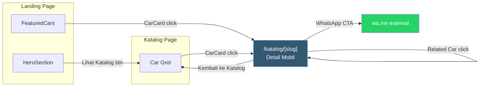
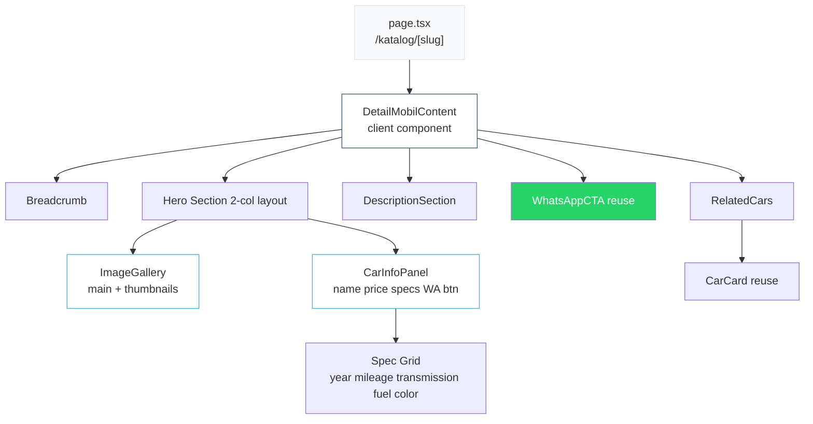

# Implementation Plan — Detail Mobil (`/katalog/[slug]`)

Referensi: [Katalog Plan](file:///f:/Coding/Showroom-mobil-laravel/implementation_plan_katalog.md)

---

## 1. Navigation Flow

Ketika user klik `CarCard` di halaman Katalog atau FeaturedCars, mereka akan diarahkan ke halaman detail mobil via `<Link href={/katalog/${car.slug}}>` yang sudah ada di [CarCard.tsx](file:///f:/Coding/Showroom-mobil-laravel/frontend/src/components/public/CarCard.tsx#L14).



---

## 2. Component Architecture



---

## 3. Files to Create / Modify

| # | File | Action | Description |
|---|------|--------|-------------|
| 1 | `app/(public)/katalog/[slug]/page.tsx` | **NEW** | Server component, metadata, slug param |
| 2 | `app/(public)/katalog/[slug]/detail-content.tsx` | **NEW** | Client component, assembles all sections |
| 3 | `components/public/Breadcrumb.tsx` | **NEW** | Reusable breadcrumb navigation |
| 4 | `components/public/ImageGallery.tsx` | **NEW** | Main image + thumbnail strip |
| 5 | `components/public/CarInfoPanel.tsx` | **NEW** | Name, price, spec grid, WA button |
| 6 | `components/public/DescriptionSection.tsx` | **NEW** | Full description text |
| 7 | `components/public/RelatedCars.tsx` | **NEW** | Grid of related CarCards |
| 8 | `lib/mock-data.ts` | **MODIFY** | Add helper `getCarBySlug()`, `getRelatedCars()` |

---

## 4. Section Detail & Wireframes

### 4.1 Breadcrumb

```
Desktop:
+------------------------------------------------------------------+
|  bg: #F8FAFC   pt-28 pb-4                                        |
|                                                                   |
|  Beranda  >  Katalog  >  Toyota Avanza 1.5 G                     |
|                                                                   |
+------------------------------------------------------------------+
```

**Specs:**
- Background: `var(--color-soft-bg)` — consistent with CatalogHeader
- Items: `text-sm text-slate-500`, links: `hover:text-[var(--color-primary)]`
- Active (last item): `text-slate-900 font-medium`, non-clickable
- Separator: `ChevronRight` icon dari lucide-react, `size={14}`
- Semantic: `<nav aria-label="Breadcrumb">` + `<ol>`

### 4.2 Hero Section (Image + Info — 2 Column)

```
Desktop:
+------------------------------------------------------------------+
|  bg: #F8FAFC   pb-12                                              |
|                                                                   |
|  +----------------------------+  +---------------------------+    |
|  |                            |  |  Toyota Avanza 1.5 G      |    |
|  |     Main Image             |  |                           |    |
|  |     (aspect 4:3)           |  |  Rp 185.000.000           |    |
|  |     gradient placeholder   |  |                           |    |
|  |                            |  |  +-----+ +-----+ +-----+ |    |
|  |  [TERJUAL] / [Pilihan]     |  |  |2021 | |35rb | |Man. | |    |
|  |                            |  |  |Tahun| | KM  | |Trans| |    |
|  |                            |  |  +-----+ +-----+ +-----+ |    |
|  +----------------------------+  |  +-----+ +-----+         |    |
|  | [thumb] [thumb] [thumb]    |  |  |Benz.| |Silv.|         |    |
|  +----------------------------+  |  |Fuel | |Wrna |         |    |
|                                  |  +-----+ +-----+         |    |
|                                  |                           |    |
|                                  |  [Hubungi via WA]         |    |
|                                  |  [Kembali ke Katalog]     |    |
|                                  +---------------------------+    |
+------------------------------------------------------------------+
```

**ImageGallery Specs:**
- Main image: `aspect-[4/3]`, rounded-lg, CSS gradient placeholder (same as CarCard)
- Badge overlay: reuse `Badge` component (TERJUAL / Pilihan Utama) — same pattern as CarCard
- Thumbnail strip: `flex gap-2 mt-3`, each `h-16 w-20 rounded-md cursor-pointer`
- Active thumbnail: `ring-2 ring-[var(--color-primary)]`
- Inactive thumbnail: `opacity-60 hover:opacity-100 transition-opacity`
- Click thumbnail → swaps main image (local state)

**CarInfoPanel Specs:**
- Name: `text-2xl md:text-3xl font-bold text-slate-900`
- Price: `text-2xl font-bold text-[var(--color-primary)] mt-2`
- Spec grid: `grid grid-cols-2 sm:grid-cols-3 gap-3 mt-6`
- Each spec card: `bg-slate-50 rounded-lg p-3 text-center`
  - Icon: lucide-react, `size={20}`, `text-[var(--color-secondary)]`
  - Value: `text-sm font-semibold text-slate-900`
  - Label: `text-xs text-slate-500`
- Spec items: Tahun (`Calendar`), Kilometer (`Gauge`), Transmisi (`Settings2`), BBM (`Fuel`), Warna (`Palette`)
- WA button: `Button variant="whatsapp" size="lg"` — reuse, full width
  - Message: `"Halo, saya tertarik dengan {car.name} (Rp {price}). Apakah masih tersedia?"`
- "Kembali ke Katalog": `Link`, `text-sm text-[var(--color-secondary)] hover:underline`

### 4.3 Description Section

```
+------------------------------------------------------------------+
|  bg: white   py-12                                                |
|                                                                   |
|  Deskripsi                                                        |
|  ----------                                                       |
|  Kondisi sangat terawat, pemakaian pribadi, pajak hidup.          |
|  Lorem ipsum dolor sit amet...                                    |
|                                                                   |
+------------------------------------------------------------------+
```

**Specs:**
- Heading: `text-xl font-bold text-slate-900 mb-4`
- Text: `text-slate-600 leading-relaxed whitespace-pre-line`
- Container: `max-w-3xl` (readable width)

### 4.4 Related Cars

```
+------------------------------------------------------------------+
|  bg: #F8FAFC   py-16                                              |
|                                                                   |
|  Mobil Lainnya                                                    |
|                                                                   |
|  +----------+  +----------+  +----------+  +----------+          |
|  | CarCard  |  | CarCard  |  | CarCard  |  | CarCard  |          |
|  +----------+  +----------+  +----------+  +----------+          |
|                                                                   |
+------------------------------------------------------------------+
```

**Specs:**
- Logic: filter mobil brand sama, exclude current, max 4. Jika < 4, fill dari brand lain
- Heading: `text-2xl md:text-3xl font-bold text-slate-900` — consistent with FeaturedCars
- Grid: `grid-cols-1 sm:grid-cols-2 lg:grid-cols-4 gap-6`
- Reuse `CarCard` component — zero modifications
- Animation: `fadeUpVariants` + `staggerContainer`

---

## 5. Page Layout (Full)

```
Desktop:
+------------------------------------------------------------------+
|  Navbar (sticky, shared via layout)                               |
+------------------------------------------------------------------+
|  Breadcrumb                                          bg: soft-bg  |
+------------------------------------------------------------------+
|  Hero: ImageGallery (left) + CarInfoPanel (right)    bg: soft-bg  |
+------------------------------------------------------------------+
|  DescriptionSection                                  bg: white    |
+------------------------------------------------------------------+
|  WhatsAppCTA (reuse from landing)                    bg: gradient |
+------------------------------------------------------------------+
|  RelatedCars                                         bg: soft-bg  |
+------------------------------------------------------------------+
|  Footer (shared via layout)                                       |
+------------------------------------------------------------------+

Mobile:
+----------------------+
|  Navbar              |
+----------------------+
|  Breadcrumb          |
+----------------------+
|  ImageGallery        |
|  (full width)        |
+----------------------+
|  CarInfoPanel        |
|  (full width, below) |
+----------------------+
|  DescriptionSection  |
+----------------------+
|  WhatsAppCTA         |
+----------------------+
|  RelatedCars (1 col) |
+----------------------+
|  Footer              |
+----------------------+
```

---

## 6. Responsive Behavior

| Section | Mobile (<640px) | Tablet (768px) | Desktop (>=1024px) |
|---------|----------------|----------------|-------------------|
| **Breadcrumb** | Truncate car name | Full | Full |
| **Hero Layout** | Stack (image lalu info) | Stack | 2 columns (7:5 ratio) |
| **Thumbnails** | Horizontal scroll | 4 visible | 4 visible |
| **Spec Grid** | 2 columns | 3 columns | 3 columns |
| **WA Button** | Full width | Full width | Full width |
| **Related Cars** | 1 column | 2 columns | 4 columns |

---

## 7. Mock Data Extension

Tambahkan helper functions ke `lib/mock-data.ts`:

```typescript
export function getCarBySlug(slug: string): Car | undefined {
  return mockCars.find(car => car.slug === slug);
}

export function getRelatedCars(currentCar: Car, limit = 4): Car[] {
  const sameBrand = mockCars.filter(
    c => c.brand === currentCar.brand && c.id !== currentCar.id
  );
  const others = mockCars.filter(
    c => c.brand !== currentCar.brand && c.id !== currentCar.id
  );
  return [...sameBrand, ...others].slice(0, limit);
}
```

> [!NOTE]
> Saat backend siap, helper ini diganti dengan API call `GET /api/cars/{slug}`.

---

## 8. Animation Specs

Reuse existing patterns dari `lib/animations.ts`:

- **Page enter**: `fadeUpVariants` pada setiap section
- **Stagger**: `staggerContainer` pada spec grid dan related cars
- **Image thumbnail switch**: CSS transition `opacity` 300ms (no framer-motion needed)
- **WA CTA**: reuse `WhatsAppCTA` component langsung (sudah ada animasinya)

---

## 9. SEO & Metadata

```typescript
// Dynamic metadata via generateMetadata()
export async function generateMetadata({ params }: Props): Promise<Metadata> {
  const car = getCarBySlug(params.slug);
  return {
    title: car ? `${car.name} - Garasirumahan` : "Mobil Tidak Ditemukan",
    description: car?.description || "Detail mobil bekas di Garasirumahan.",
  };
}
```

- `<h1>`: Nama mobil (satu per halaman)
- Heading hierarchy: h1 (nama) -> h2 (Deskripsi, Mobil Lainnya)
- Semantic: `<nav>` (breadcrumb), `<article>` (detail content), `<section>` (each block)

---

## 10. 404 / Not Found State

Jika slug tidak ditemukan di data, tampilkan:

```
+------------------------------------------------------------------+
|                     [Car icon, 64px]                              |
|                                                                   |
|              Mobil tidak ditemukan                                 |
|              Mobil yang Anda cari tidak tersedia.                  |
|                                                                   |
|              [ Kembali ke Katalog ]                                |
+------------------------------------------------------------------+
```

Menggunakan `notFound()` dari Next.js -> default atau custom `not-found.tsx`.

---

## 11. Verification Plan

### Browser Tests
- Klik CarCard dari `/katalog` -> navigasi ke `/katalog/toyota-avanza-g-2021`
- Verifikasi breadcrumb menampilkan path yang benar
- Verifikasi semua data mobil tampil (nama, harga, tahun, km, dll)
- Klik thumbnail -> main image berubah
- Klik WhatsApp button -> buka wa.me dengan pesan yang benar
- Klik "Kembali ke Katalog" -> kembali ke `/katalog`
- Verifikasi related cars menampilkan mobil brand sama
- Klik related car -> navigasi ke detail mobil lain
- Test slug tidak valid -> tampil 404
- Test responsive di 375px, 768px, 1024px, 1440px

### Quality Checks
- Warna, font, spacing konsisten dengan katalog dan landing page
- Badge (TERJUAL/Pilihan) identik dengan CarCard
- Hover states smooth (150-300ms)
- `prefers-reduced-motion` respected
- Semantic HTML dan proper heading hierarchy
- No emoji as icons (lucide-react only)
