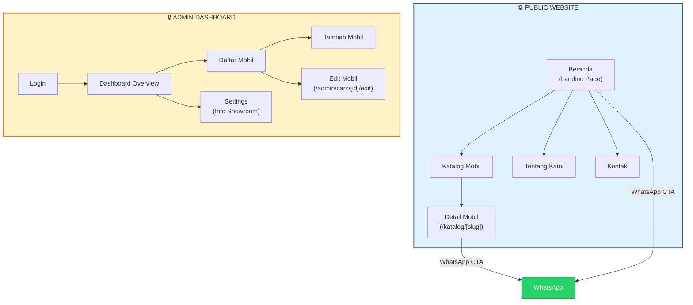
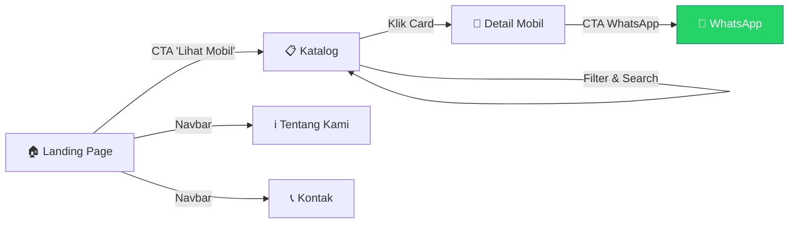
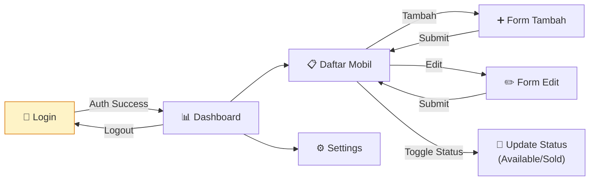
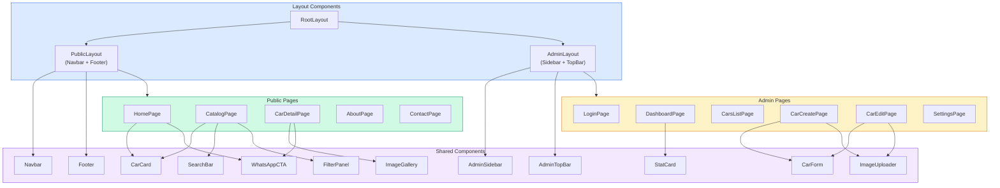
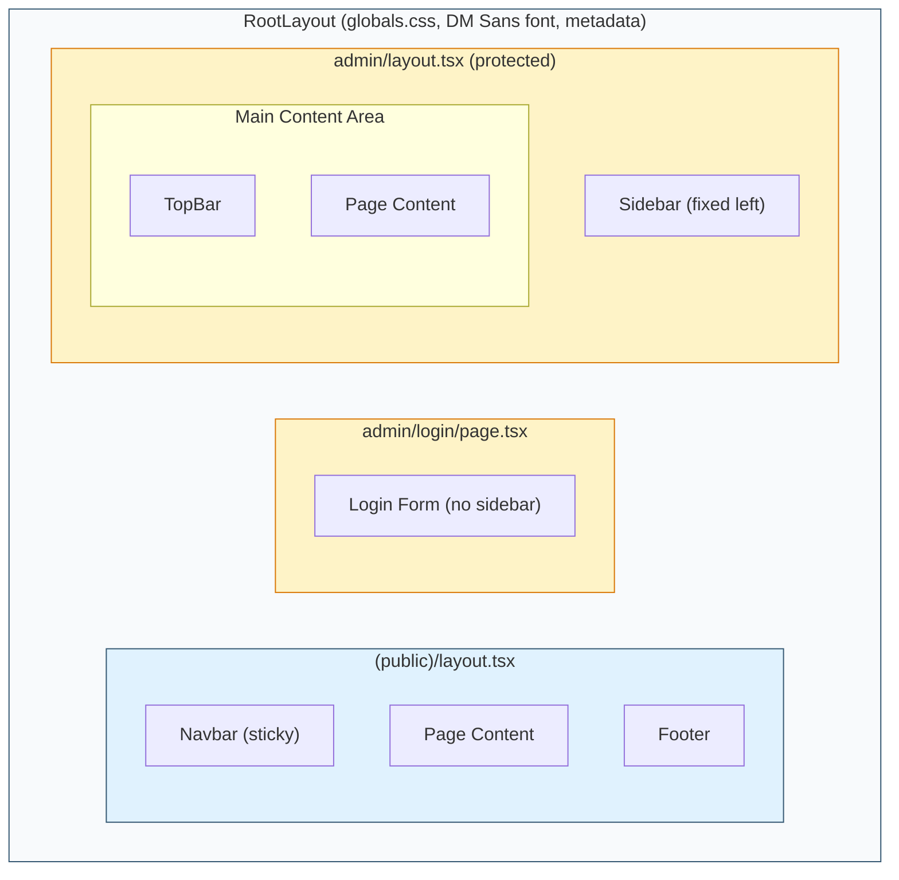

# 🚗 Garasirumahan — Frontend Implementation Plan

## Overview

Frontend untuk platform digital showroom mobil bekas **Garasirumahan**, dibangun dengan **Next.js 15 (App Router)**, **React 19**, **Tailwind CSS 4**, dan **Framer Motion 11**. Frontend berkomunikasi dengan backend **Laravel 12** via REST API.

Plan ini fokus pada **UI/UX, navigasi, dan struktur folder** bagian frontend saja.

---

## 1. Design System

### Color Palette (Sesuai PRD)

| Token | Hex | Penggunaan |
|-------|-----|------------|
| `--primary` | `#355872` | Navbar, main button, heading emphasis, price |
| `--secondary` | `#7AAACE` | Secondary button, section bg, hover state |
| `--background` | `#FFFFFF` | Main layout, cards, forms |
| `--soft-bg` | `#F8FAFC` | Alternate sections, dashboard content bg |
| `--text-dark` | `#1E293B` | Headings, body text |
| `--border` | `#E2E8F0` | Input border, card border, divider |
| `--accent` | `#4DA8DA` | CTA highlight, interactive state, link hover |
| `--success` | `#22C55E` | Available status badge |
| `--danger` | `#EF4444` | SOLD badge, delete action |

### Typography

| Element | Font | Weight | Size |
|---------|------|--------|------|
| Heading | **DM Sans** | 700 (Bold) | 2xl–5xl |
| Subheading | **DM Sans** | 600 (Semibold) | lg–2xl |
| Body | **DM Sans** | 400 (Regular) | sm–base |
| Button / CTA | **DM Sans** | 600 (Semibold) | sm–base |
| Caption / Label | **DM Sans** | 500 (Medium) | xs–sm |

> [!NOTE]
> DM Sans digunakan sebagai fallback Google Fonts dari rekomendasi Satoshi/General Sans. Cocok untuk branding premium, modern, dan clean.

### Spacing Scale

```
4px — 8px — 12px — 16px — 24px — 32px — 48px — 64px — 96px — 128px
```

### Shadows

| Level | CSS | Penggunaan |
|-------|-----|------------|
| `sm` | `0 1px 2px rgba(0,0,0,0.05)` | Subtle card |
| `md` | `0 4px 6px -1px rgba(0,0,0,0.1)` | Card default |
| `lg` | `0 10px 15px -3px rgba(0,0,0,0.1)` | Card hover |
| `xl` | `0 20px 25px -5px rgba(0,0,0,0.1)` | Modal / overlay |

### Border Radius

| Token | Value | Penggunaan |
|-------|-------|------------|
| `sm` | `6px` | Input, small badges |
| `md` | `8px` | Cards, buttons |
| `lg` | `12px` | Large cards, modals |
| `xl` | `16px` | Hero cards, featured |
| `full` | `9999px` | Badges, pills |

### Animation Strategy

| Effect | Durasi | Easing | Library |
|--------|--------|--------|---------|
| Scroll reveal (fade up) | 500ms | `easeOut` | Framer Motion |
| Hover card (lift + shadow) | 200ms | `ease` | Tailwind transition |
| Page transition | 300ms | `easeInOut` | Framer Motion |
| Button hover | 150ms | `ease` | Tailwind transition |
| Image gallery slide | 400ms | `spring` | Framer Motion |
| Mobile menu open/close | 250ms | `easeOut` | Framer Motion |

> [!IMPORTANT]
> Semua animasi harus menghormati `prefers-reduced-motion`. Gunakan hook `useReducedMotion` dari Framer Motion.

### Responsive Breakpoints

| Breakpoint | Width | Target |
|------------|-------|--------|
| `mobile` | < 640px | Smartphone |
| `sm` | ≥ 640px | Large phone |
| `md` | ≥ 768px | Tablet |
| `lg` | ≥ 1024px | Laptop |
| `xl` | ≥ 1280px | Desktop |
| `2xl` | ≥ 1536px | Large screen |

---

## 2. Arsitektur Navigasi

### 2.1 Sitemap Diagram



### 2.2 User Flow — Visitor



### 2.3 User Flow — Admin



### 2.4 Komponen Hierarchy



---

## 3. Detail Halaman & Section

### 3.1 Public Website

#### Landing Page (`/`)

| Section | Konten | Komponen |
|---------|--------|----------|
| **Hero** | Headline utama, subheadline, CTA "Lihat Katalog" | Full-width, gradient overlay pada background image |
| **Featured Cars** | Grid 3–4 mobil `featured: true` | `CarCard` dengan badge "Unggulan" |
| **Keunggulan** | 3–4 value proposition (trust, garansi, harga) | Icon cards dengan animasi scroll reveal |
| **CTA WhatsApp** | Banner dengan CTA ke WhatsApp | `WhatsAppCTA` full-width section |

#### Katalog (`/katalog`)

| Section | Konten | Komponen |
|---------|--------|----------|
| **Header** | Judul halaman + search bar | `SearchBar` |
| **Filter Sidebar/Drawer** | Brand, Harga range, Tahun, Transmisi | `FilterPanel` (drawer di mobile) |
| **Car Grid** | Grid responsive card mobil | `CarCard` grid 1/2/3 kolom |
| **Pagination** | Load more atau numbered pagination | Custom pagination |

#### Detail Mobil (`/katalog/[slug]`)

| Section | Konten | Komponen |
|---------|--------|----------|
| **Gallery** | Image slider/carousel | `ImageGallery` (Embla Carousel + Framer Motion) |
| **Info Utama** | Nama, harga, tahun, KM, transmisi, fuel | Spec grid |
| **Deskripsi** | Teks deskripsi lengkap | Prose content area |
| **CTA WhatsApp** | Tombol sticky di mobile, inline di desktop | `WhatsAppCTA` |

#### Tentang Kami (`/tentang`)

| Section | Konten | Komponen |
|---------|--------|----------|
| **Hero** | Judul + deskripsi singkat | Section header |
| **Profil** | Cerita showroom, pengalaman | Content block |
| **Keunggulan** | Alasan memilih showroom ini | Feature cards |

#### Kontak (`/kontak`)

| Section | Konten | Komponen |
|---------|--------|----------|
| **Info Kontak** | WA, alamat, jam operasional | Contact info cards |
| **Maps** | Google Maps embed | Iframe responsive |

---

### 3.2 Admin Dashboard

#### Login (`/admin/login`)

| Element | Detail |
|---------|--------|
| Form | Email + password |
| Style | Centered, card-based, clean |
| Behavior | Redirect ke `/admin` setelah success |

#### Dashboard (`/admin`)

| Element | Detail |
|---------|--------|
| Stat Cards | Total Mobil, Available, Sold |
| Style | Grid 3 kolom, warna sesuai status |
| Quick Actions | Link ke "Tambah Mobil" dan "Daftar Mobil" |

#### Daftar Mobil (`/admin/cars`)

| Element | Detail |
|---------|--------|
| Table | Nama, brand, harga, status, actions |
| Actions per row | Edit, Delete, Toggle Status |
| Features | Search, filter by status, pagination |

#### Tambah/Edit Mobil (`/admin/cars/create` & `/admin/cars/[id]/edit`)

| Element | Detail |
|---------|--------|
| Form | Semua field: nama, brand, harga, tahun, km, transmisi, fuel, warna, deskripsi, featured |
| Image Upload | Multi upload, preview, drag & drop, delete |
| Validation | Client-side + server-side error display |

#### Settings (`/admin/settings`)

| Element | Detail |
|---------|--------|
| Form | Nama showroom, nomor WA, alamat, jam buka |
| Behavior | Auto-save atau save button |

---

## 4. Navbar & Navigation Detail

### Public Navbar

```
┌─────────────────────────────────────────────────────────────────┐
│  LOGO (Garasirumahan)    Beranda  Katalog  Tentang  Kontak     │
│                                                                 │
│  Mobile: Logo + Hamburger → Slide-down/drawer menu             │
└─────────────────────────────────────────────────────────────────┘
```

**Behavior:**
- Sticky top (fixed on scroll)
- Background transparan → solid white on scroll
- Active link indicator (underline atau warna primary)
- Mobile: hamburger → animated drawer/slide menu

### Admin Sidebar Navigation

```
┌──────────────────┐
│  GARASIRUMAHAN   │
│  Admin Panel     │
│─────────────────── │
│  📊 Dashboard    │
│  🚗 Mobil        │
│  ⚙️ Settings     │
│                  │
│                  │
│  ← Back to Site  │
│  🚪 Logout       │
└──────────────────┘
```

> [!NOTE]
> Sidebar menggunakan **SVG icons (Lucide React)**, bukan emoji. Emoji di atas hanya untuk ilustrasi.

**Behavior:**
- Desktop: sidebar fixed di kiri (240px width)
- Mobile: collapsible → hamburger trigger
- Active page highlight (background + border-left accent)
- Top bar menampilkan: page title + admin name/avatar

---

## 5. Struktur Folder

```
frontend/
├── public/
│   ├── favicon.ico
│   ├── logo.svg
│   └── images/
│       └── hero-bg.jpg
│
├── src/
│   ├── app/
│   │   ├── layout.tsx                    # Root layout (font, metadata)
│   │   ├── globals.css                   # Tailwind imports + CSS variables
│   │   │
│   │   ├── (public)/                     # Route group — Public
│   │   │   ├── layout.tsx                # Public layout (Navbar + Footer)
│   │   │   ├── page.tsx                  # Landing Page (/)
│   │   │   ├── katalog/
│   │   │   │   ├── page.tsx              # Katalog (/katalog)
│   │   │   │   └── [slug]/
│   │   │   │       └── page.tsx          # Detail Mobil (/katalog/[slug])
│   │   │   ├── tentang/
│   │   │   │   └── page.tsx              # Tentang Kami (/tentang)
│   │   │   └── kontak/
│   │   │       └── page.tsx              # Kontak (/kontak)
│   │   │
│   │   └── admin/                        # Admin routes
│   │       ├── login/
│   │       │   └── page.tsx              # Login page
│   │       ├── layout.tsx                # Admin layout (Sidebar + TopBar)
│   │       ├── page.tsx                  # Dashboard (/admin)
│   │       ├── cars/
│   │       │   ├── page.tsx              # Daftar Mobil (/admin/cars)
│   │       │   ├── create/
│   │       │   │   └── page.tsx          # Tambah Mobil
│   │       │   └── [id]/
│   │       │       └── edit/
│   │       │           └── page.tsx      # Edit Mobil
│   │       └── settings/
│   │           └── page.tsx              # Settings
│   │
│   ├── components/
│   │   ├── ui/                           # Primitif / base components
│   │   │   ├── Button.tsx
│   │   │   ├── Input.tsx
│   │   │   ├── Badge.tsx
│   │   │   ├── Card.tsx
│   │   │   ├── Modal.tsx
│   │   │   ├── Select.tsx
│   │   │   ├── Textarea.tsx
│   │   │   └── Skeleton.tsx
│   │   │
│   │   ├── public/                       # Komponen khusus public
│   │   │   ├── Navbar.tsx
│   │   │   ├── Footer.tsx
│   │   │   ├── HeroSection.tsx
│   │   │   ├── FeaturedCars.tsx
│   │   │   ├── AdvantagesSection.tsx
│   │   │   ├── CarCard.tsx
│   │   │   ├── SearchBar.tsx
│   │   │   ├── FilterPanel.tsx
│   │   │   ├── ImageGallery.tsx
│   │   │   ├── WhatsAppCTA.tsx
│   │   │   └── ContactInfo.tsx
│   │   │
│   │   └── admin/                        # Komponen khusus admin
│   │       ├── Sidebar.tsx
│   │       ├── TopBar.tsx
│   │       ├── StatCard.tsx
│   │       ├── CarForm.tsx
│   │       ├── CarTable.tsx
│   │       ├── ImageUploader.tsx
│   │       ├── SettingsForm.tsx
│   │       └── StatusBadge.tsx
│   │
│   ├── lib/
│   │   ├── api.ts                        # Axios/fetch config + base URL
│   │   ├── types.ts                      # TypeScript interfaces (Car, Setting, etc.)
│   │   └── utils.ts                      # Helper functions (formatPrice, generateWALink)
│   │
│   ├── hooks/
│   │   ├── useCars.ts                    # Fetch cars (TBD saat fase backend)
│   │   ├── useCarDetail.ts               # Fetch single car
│   │   ├── useSettings.ts                # Fetch showroom settings
│   │   ├── useAuth.ts                    # Auth state management
│   │   └── useMediaQuery.ts              # Responsive breakpoint hook
│   │
│   ├── context/
│   │   └── AuthContext.tsx               # Auth provider (login state, token)
│   │
│   └── config/
│       └── constants.ts                  # API base URL, pagination limits, dll
│
├── tailwind.config.ts                    # Tailwind custom theme (colors, fonts)
├── next.config.ts                        # Next.js config (images remote, rewrites)
├── tsconfig.json
├── package.json
└── .env.local                            # NEXT_PUBLIC_API_URL=http://127.0.0.1:8000
```

> [!IMPORTANT]
> Route group `(public)` digunakan agar public pages berbagi layout (Navbar + Footer) tanpa mempengaruhi URL. Admin login page (`/admin/login`) memiliki layout terpisah tanpa sidebar.

---

## 6. Layout Architecture

### 6.1 Layout Diagram



### 6.2 Public Layout Structure

```
┌──────────────────────────────────────────────────────────┐
│  NAVBAR (sticky, bg transition on scroll)                │
├──────────────────────────────────────────────────────────┤
│                                                          │
│                    PAGE CONTENT                          │
│                  (children prop)                         │
│                                                          │
├──────────────────────────────────────────────────────────┤
│  FOOTER (navigasi, kontak, copyright)                    │
└──────────────────────────────────────────────────────────┘
```

### 6.3 Admin Layout Structure

```
┌────────────┬─────────────────────────────────────────────┐
│            │  TOPBAR (page title, admin info, logout)    │
│  SIDEBAR   ├─────────────────────────────────────────────┤
│  (240px)   │                                             │
│            │             PAGE CONTENT                    │
│  Dashboard │           (children prop)                   │
│  Mobil     │                                             │
│  Settings  │                                             │
│            │                                             │
│  ───────   │                                             │
│  Back      │                                             │
│  Logout    │                                             │
└────────────┴─────────────────────────────────────────────┘
```

---

## 7. Key UI Components Specification

### CarCard

```
┌──────────────────────┐
│  ┌──────────────────┐ │
│  │                  │ │
│  │    CAR IMAGE     │ │
│  │   (aspect 4:3)   │ │
│  │                  │ │
│  │  [SOLD] badge    │ │
│  └──────────────────┘ │
│  Toyota Avanza 2021   │
│  Rp 185.000.000       │
│  2021 • Manual        │
│  ─────────────────── │
│  [ Lihat Detail → ]  │
└──────────────────────┘
```

**Behavior:** Hover → slight lift (translateY -4px) + shadow upgrade. Cursor pointer.

### WhatsApp CTA Button

```
┌─────────────────────────────────────┐
│  💬  Hubungi Kami via WhatsApp      │
│  (Buka pesan otomatis)              │
└─────────────────────────────────────┘
```

**Link format:** `https://wa.me/62xxx?text=Halo, saya tertarik dengan unit [Nama Mobil]`

### Image Gallery

- Desktop: Main image besar + thumbnail strip di bawah
- Mobile: Swipeable carousel
- Klik thumbnail → animasi crossfade ke main image
- Support pinch-to-zoom (mobile)

---

## 8. State Management & Data Fetching

> [!NOTE]
> Detail integrasi backend (data fetching library, API config) akan dibahas terpisah saat fase backend. Saat ini fokus ke **UI/UX statis** menggunakan mock data.

| Concern | Strategy |
|---------|----------|
| **UI state (filter, search)** | URL search params (`useSearchParams`) |
| **Form state** | React Hook Form + Zod validation |
| **Auth state** | React Context (`AuthContext`) — detail saat fase backend |
| **Server state** | TBD — akan ditentukan saat fase backend |

---

## 9. Dependencies

| Package | Version | Purpose |
|---------|---------|---------|
| `next` | ^15.x | Framework |
| `react` | ^19.x | UI Library |
| `tailwindcss` | ^4.x | Styling |
| `framer-motion` | ^11.x | Animations |
| `lucide-react` | latest | Icon library (SVG) |
| `react-hook-form` | latest | Form management |
| `zod` | latest | Schema validation |
| `@hookform/resolvers` | latest | Zod + React Hook Form |
| `embla-carousel-react` | latest | Image carousel/gallery |

---

## Decisions Made

| # | Keputusan | Detail |
|---|-----------|--------|
| 1 | **Data Fetching** | Ditunda — fokus frontend UI dulu, backend dibahas terpisah |
| 2 | **Image Carousel** | ✅ **Embla Carousel** (lightweight, touch-friendly) |
| 3 | **Login Layout** | ✅ Standalone centered form, tanpa sidebar |
| 4 | **Bahasa UI** | Mixed — **tidak semua Bahasa Indonesia**. Contoh: "View Details", "Contact via WhatsApp", "Dashboard", "Settings", dll. Gunakan bahasa Indonesia untuk konten spesifik showroom (nama section, heading), dan English untuk UI patterns umum (button actions, labels, navigation) |

---

## Verification Plan

### Automated Tests
- Lighthouse audit: Performance ≥ 90, Accessibility ≥ 90
- Mobile responsive check di 375px, 768px, 1024px, 1440px via browser tool
- Navigation flow test: setiap link/button mengarah ke halaman yang benar

### Manual Verification
- Visual review setiap halaman di browser
- Test scroll behavior navbar (transparan → solid)
- Test filter & search di katalog
- Test form validation di admin
- Test WhatsApp CTA link format
- Test image gallery swipe di mobile viewport
