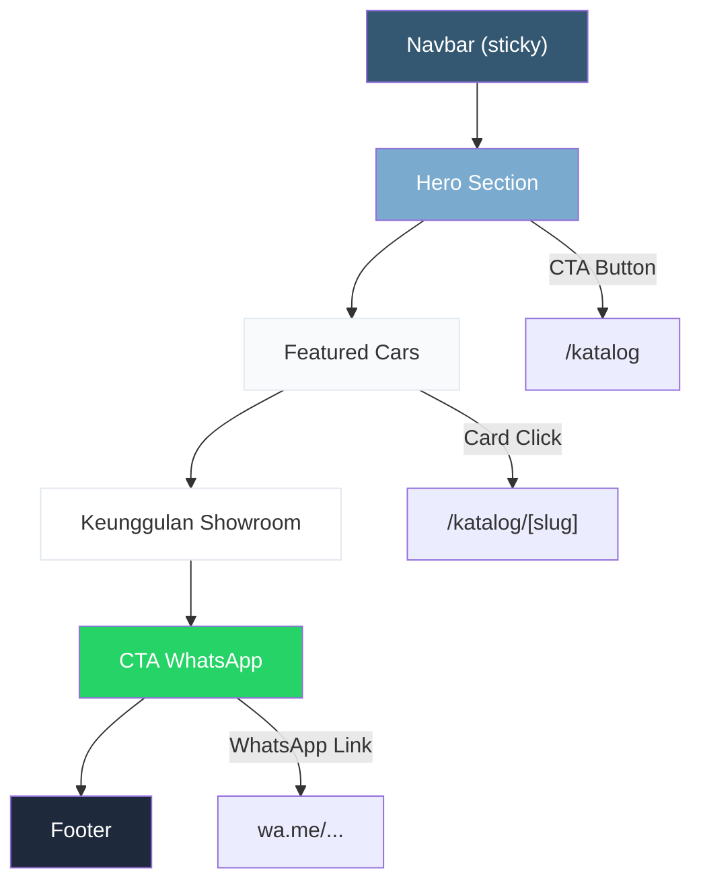

# 🏠 Implementation Plan — Frontend Landing Page

Referensi: [Implementation Plan Frontend (Global)](file:///d:/Coding/garasirumahan-laravel1/implementation_plan_frontend_all.md) | [PRD](file:///d:/Coding/garasirumahan-laravel1/PRD.md)

---

## 1. Scope & Section Order

Landing page terdiri dari **6 section** dalam urutan berikut:

```
1. Navbar (sticky, shared component)
2. Hero Section
3. Featured Cars (mobil unggulan)
4. Keunggulan Showroom (why choose us)
5. CTA WhatsApp (full-width banner)
6. Footer (shared component)
```

### Section Flow Diagram



---

## 2. Files to Create

### Execution Order

| # | File | Type | Description |
|---|------|------|-------------|
| 1 | `frontend/src/app/globals.css` | CSS | Design tokens, Tailwind imports, base styles |
| 2 | `frontend/src/app/layout.tsx` | Layout | Root layout (DM Sans font, metadata) |
| 3 | `frontend/src/lib/types.ts` | Types | Car, Setting interfaces |
| 4 | `frontend/src/lib/utils.ts` | Utils | formatPrice, generateWALink |
| 5 | `frontend/src/lib/mock-data.ts` | Data | Mock cars & settings untuk development |
| 6 | `frontend/src/components/ui/Button.tsx` | Component | Reusable button (primary, secondary, whatsapp) |
| 7 | `frontend/src/components/ui/Badge.tsx` | Component | Status badge (SOLD, Featured) |
| 8 | `frontend/src/components/ui/Card.tsx` | Component | Base card wrapper |
| 9 | `frontend/src/components/public/Navbar.tsx` | Component | Sticky navbar + mobile menu |
| 10 | `frontend/src/components/public/Footer.tsx` | Component | Footer navigation + info |
| 11 | `frontend/src/components/public/HeroSection.tsx` | Component | Hero banner |
| 12 | `frontend/src/components/public/CarCard.tsx` | Component | Car listing card |
| 13 | `frontend/src/components/public/FeaturedCars.tsx` | Component | Featured cars grid section |
| 14 | `frontend/src/components/public/AdvantagesSection.tsx` | Component | Why choose us section |
| 15 | `frontend/src/components/public/WhatsAppCTA.tsx` | Component | WA CTA banner section |
| 16 | `frontend/src/app/(public)/layout.tsx` | Layout | Public layout (Navbar + Footer wrapper) |
| 17 | `frontend/src/app/(public)/page.tsx` | Page | Landing page (assembles all sections) |

---

## 3. Section Detail & Wireframes

### 3.1 Navbar

```
Desktop (≥1024px):
┌──────────────────────────────────────────────────────────────────┐
│  🚗 Garasirumahan          Beranda  Katalog  Tentang  Kontak    │
└──────────────────────────────────────────────────────────────────┘

Mobile (<1024px):
┌──────────────────────────────────────────────────────────────────┐
│  🚗 Garasirumahan                                    [☰]        │
└──────────────────────────────────────────────────────────────────┘
        ↓ (drawer open)
┌──────────────────────────────────────────────────────────────────┐
│  Beranda                                                        │
│  Katalog                                                        │
│  Tentang                                                        │
│  Kontak                                                         │
└──────────────────────────────────────────────────────────────────┘
```

**Specs:**
- Position: `fixed top-0`, z-index: 50
- Scroll behavior: `bg-transparent` → `bg-white/95 backdrop-blur-md shadow-sm` after 50px scroll
- Active link: `text-primary` + bottom border 2px
- Mobile menu: Framer Motion `AnimatePresence` slide-down
- Height: 72px desktop, 64px mobile
- Max-width container: `max-w-7xl mx-auto`
- Logo: text-based "Garasirumahan" in DM Sans Bold, `text-primary`

---

### 3.2 Hero Section

```
Desktop:
┌──────────────────────────────────────────────────────────────────┐
│                                                                  │
│  ┌─────────────────────────────┐  ┌────────────────────────────┐ │
│  │                             │  │                            │ │
│  │  Temukan Mobil Bekas        │  │                            │ │
│  │  Impian Anda                │  │      HERO IMAGE            │ │
│  │                             │  │      (Car photo)           │ │
│  │  Showroom terpercaya dengan │  │                            │ │
│  │  koleksi mobil bekas        │  │                            │ │
│  │  berkualitas terbaik.       │  │                            │ │
│  │                             │  │                            │ │
│  │  [ Lihat Katalog → ]       │  └────────────────────────────┘ │
│  │  [ Contact Us ]            │                                  │
│  └─────────────────────────────┘                                 │
│                                                                  │
│       🚗 100+ Unit    ⭐ Terpercaya    🔧 Garansi               │
│                                                                  │
└──────────────────────────────────────────────────────────────────┘

Mobile:
┌──────────────────────┐
│                      │
│  Temukan Mobil Bekas │
│  Impian Anda         │
│                      │
│  Showroom terpercaya │
│  dengan koleksi...   │
│                      │
│  [ Lihat Katalog → ] │
│  [ Contact Us ]      │
│                      │
│  ┌──────────────────┐│
│  │   HERO IMAGE     ││
│  │                  ││
│  └──────────────────┘│
│                      │
│  🚗 100+  ⭐ Trust  │
│  🔧 Garansi         │
└──────────────────────┘
```

**Specs:**
- Layout: `grid grid-cols-1 lg:grid-cols-2`, gap-12
- Background: `--soft-bg` (#F8FAFC)
- Padding top: 72px (navbar height) + 64px section padding
- Headline: DM Sans Bold, `text-4xl md:text-5xl lg:text-6xl`, color `--text-dark`
- Subheadline: DM Sans Regular, `text-lg`, color `#64748B` (slate-500)
- Primary CTA: `Button` variant="primary", links to `/katalog`
- Secondary CTA: `Button` variant="outline", links to WhatsApp
- Stats strip: 3 items inline, icon + number + label, `text-primary`
- Hero image: `next/image` with priority loading, aspect 4:3, rounded-xl
- Animation: text fade-in from left (stagger 100ms), image fade-in from right

**Stats data (hardcoded):**
```
{ icon: Car, value: "100+", label: "Unit Tersedia" }
{ icon: Star, value: "500+", label: "Pelanggan Puas" }
{ icon: ShieldCheck, value: "10+", label: "Tahun Pengalaman" }
```

---

### 3.3 Featured Cars

```
Desktop:
┌──────────────────────────────────────────────────────────────────┐
│                                                                  │
│              Mobil Unggulan Kami                                  │
│              Pilihan terbaik yang kami rekomendasikan             │
│                                                                  │
│   ┌─────────────┐  ┌─────────────┐  ┌─────────────┐            │
│   │  ┌─────────┐│  │  ┌─────────┐│  │  ┌─────────┐│            │
│   │  │  IMAGE  ││  │  │  IMAGE  ││  │  │  IMAGE  ││            │
│   │  │         ││  │  │         ││  │  │ [SOLD]  ││            │
│   │  └─────────┘│  │  └─────────┘│  │  └─────────┘│            │
│   │  Avanza '21 │  │  Xenia '20  │  │  Jazz '19   │            │
│   │  Rp 185jt   │  │  Rp 160jt   │  │  Rp 210jt   │            │
│   │  2021 • MT  │  │  2020 • AT  │  │  2019 • AT  │            │
│   │  [View →]   │  │  [View →]   │  │  [View →]   │            │
│   └─────────────┘  └─────────────┘  └─────────────┘            │
│                                                                  │
│              [ Lihat Semua Mobil → ]                              │
│                                                                  │
└──────────────────────────────────────────────────────────────────┘
```

**Specs:**
- Background: `--background` (#FFFFFF)
- Section heading: centered, DM Sans Bold `text-3xl md:text-4xl`
- Subtitle: DM Sans Regular `text-lg`, color slate-500
- Grid: `grid-cols-1 sm:grid-cols-2 lg:grid-cols-3`, gap-6
- Show only `featured: true` cars (max 3–4)
- Bottom CTA: "Lihat Semua Mobil" → link to `/katalog`
- Animation: cards stagger fade-up on scroll (IntersectionObserver via Framer Motion `whileInView`)

**CarCard Component:**

```
Props:
  car: Car           // Car data object
  
Renders:
  - Image container: aspect-[4/3], overflow-hidden, rounded-t-lg
    - next/image fill, object-cover
    - SOLD badge: absolute top-right, bg-danger, text-white, rounded-full pill
  - Content: p-4
    - Name: DM Sans Semibold, text-lg, truncate
    - Price: DM Sans Bold, text-xl, text-primary
    - Meta: year • transmission, text-sm, text-slate-500
    - Divider: border-t, border-color
    - CTA: "View Details →", text-accent, hover:underline
  
Hover behavior:
  - Card: translateY(-4px), shadow-sm → shadow-lg
  - Image: scale(1.05) transition 300ms
  - Cursor: pointer
```

---

### 3.4 Keunggulan Showroom (Why Choose Us)

```
Desktop:
┌──────────────────────────────────────────────────────────────────┐
│  bg: #F8FAFC                                                     │
│                                                                  │
│              Mengapa Memilih Kami?                                │
│              Komitmen kami untuk pelayanan terbaik                │
│                                                                  │
│   ┌──────────────┐  ┌──────────────┐  ┌──────────────┐          │
│   │   [icon]     │  │   [icon]     │  │   [icon]     │          │
│   │              │  │              │  │              │          │
│   │  Unit        │  │  Harga       │  │  Dokumen     │          │
│   │  Berkualitas │  │  Transparan  │  │  Lengkap     │          │
│   │              │  │              │  │              │          │
│   │  Deskripsi   │  │  Deskripsi   │  │  Deskripsi   │          │
│   │  singkat..   │  │  singkat..   │  │  singkat..   │          │
│   └──────────────┘  └──────────────┘  └──────────────┘          │
│                                                                  │
│   ┌──────────────┐                                               │
│   │   [icon]     │                                               │
│   │  Garansi     │                                               │
│   │  Mesin       │                                               │
│   └──────────────┘                                               │
│                                                                  │
└──────────────────────────────────────────────────────────────────┘
```

**Specs:**
- Background: `--soft-bg` (#F8FAFC)
- Grid: `grid-cols-1 sm:grid-cols-2 lg:grid-cols-4`, gap-6
- Cards: bg-white, rounded-lg, p-6, shadow-sm, border `--border`
- Icon: Lucide icon (48px) dalam circle bg `--secondary/10`, color `--primary`
- Title: DM Sans Semibold, text-lg
- Description: DM Sans Regular, text-sm, slate-500
- Hover: shadow-sm → shadow-md, border-color → `--accent`
- Animation: stagger fade-up per card on scroll

**Data (hardcoded):**
```
{ icon: CarFront,    title: "Unit Berkualitas",  desc: "Setiap unit melalui inspeksi menyeluruh..." }
{ icon: BadgeDollarSign, title: "Harga Transparan", desc: "Tidak ada biaya tersembunyi..." }
{ icon: FileCheck,   title: "Dokumen Lengkap",  desc: "Surat-surat kendaraan terjamin..." }
{ icon: ShieldCheck, title: "Garansi Mesin",    desc: "Garansi mesin untuk ketenangan Anda..." }
```

---

### 3.5 CTA WhatsApp

```
Desktop:
┌──────────────────────────────────────────────────────────────────┐
│  bg: gradient primary → secondary                                │
│                                                                  │
│       Tertarik dengan Mobil Kami?                                 │
│       Hubungi kami sekarang untuk info lebih lanjut               │
│                                                                  │
│       [ 💬 Contact via WhatsApp ]                                │
│                                                                  │
└──────────────────────────────────────────────────────────────────┘
```

**Specs:**
- Background: `linear-gradient(135deg, #355872 0%, #4DA8DA 100%)`
- Text: white, centered
- Headline: DM Sans Bold, text-2xl md:text-3xl
- Subtitle: DM Sans Regular, text-lg, white/80
- Button: bg-[#25D366], hover:bg-[#20BD5A], text-white, rounded-full, px-8 py-4
- Button icon: Lucide `MessageCircle` (bukan emoji)
- Link: `https://wa.me/{phone}?text=Halo, saya tertarik dengan mobil di Garasirumahan`
- Animation: fade-in on scroll

---

### 3.6 Footer

```
Desktop:
┌──────────────────────────────────────────────────────────────────┐
│  bg: #1E293B                                                     │
│                                                                  │
│  GARASIRUMAHAN         Navigation      Contact                   │
│  Showroom mobil bekas  Beranda          WhatsApp                 │
│  terpercaya            Katalog          Alamat                   │
│                        Tentang          Jam Operasional          │
│                        Kontak                                    │
│                                                                  │
│  ─────────────────────────────────────────────────────────────── │
│  © 2026 Garasirumahan. All rights reserved.                      │
│                                                                  │
└──────────────────────────────────────────────────────────────────┘

Mobile: stacked columns
```

**Specs:**
- Background: `--text-dark` (#1E293B)
- Text: white/90, links white/60 → hover white
- Grid: `grid-cols-1 md:grid-cols-3`, gap-8
- Logo section: brand name + tagline
- Navigation: internal links
- Contact: WA, address, hours (dari mock settings)
- Divider: `border-t border-white/20`
- Copyright: text-sm, text-white/50

---

## 4. TypeScript Interfaces

```typescript
// lib/types.ts
interface Car {
  id: number;
  slug: string;
  name: string;
  brand: string;
  price: number;
  year: number;
  mileage: number;
  transmission: "Manual" | "Automatic";
  fuel: "Bensin" | "Diesel" | "Hybrid" | "Electric";
  color: string;
  description: string;
  status: "available" | "sold";
  featured: boolean;
  images: CarImage[];
  created_at: string;
  updated_at: string;
}

interface CarImage {
  id: number;
  car_id: number;
  image_url: string;
  sort_order: number;
}

interface Settings {
  showroom_name: string;
  phone: string;
  address: string;
  open_hours: string;
  meta_title: string;
  meta_description: string;
}
```

---

## 5. Mock Data

Buat 6 mobil mock (4 featured, 2 non-featured, 1 sold) dengan data realistis Indonesia. Contoh:

```typescript
// lib/mock-data.ts
const mockCars: Car[] = [
  {
    id: 1,
    slug: "toyota-avanza-g-2021",
    name: "Toyota Avanza G 2021",
    brand: "Toyota",
    price: 185000000,
    year: 2021,
    mileage: 35000,
    transmission: "Manual",
    fuel: "Bensin",
    color: "Silver",
    status: "available",
    featured: true,
    images: [{ id: 1, car_id: 1, image_url: "/images/placeholder-car.jpg", sort_order: 1 }],
    // ...
  },
  // ... 5 more cars
];

const mockSettings: Settings = {
  showroom_name: "Garasirumahan",
  phone: "6281234567890",
  address: "Jl. Otomotif No. 123, Jakarta Selatan",
  open_hours: "Senin - Sabtu, 08:00 - 17:00",
  meta_title: "Garasirumahan - Showroom Mobil Bekas Terpercaya",
  meta_description: "Temukan mobil bekas berkualitas...",
};
```

> [!NOTE]
> Gambar mobil menggunakan placeholder gradient card (CSS-generated) selama development. Tidak generate image.

---

## 6. Animation Specs (Framer Motion)

### Scroll Reveal Wrapper

```typescript
// Reusable motion wrapper
const fadeUpVariants = {
  hidden: { opacity: 0, y: 30 },
  visible: { opacity: 1, y: 0 },
};

// Usage: whileInView="visible" initial="hidden" viewport={{ once: true, amount: 0.2 }}
// Transition: duration 0.5, ease "easeOut"
```

### Stagger Children

```typescript
const staggerContainer = {
  hidden: {},
  visible: { transition: { staggerChildren: 0.1 } },
};
```

### Navbar Scroll Effect

```typescript
// useEffect + scroll listener
// scrollY > 50 → setScrolled(true) → className changes
// bg-transparent → bg-white/95 backdrop-blur-md shadow-sm
// Transition: 200ms ease
```

### Mobile Menu

```typescript
// AnimatePresence + motion.div
// Enter: height 0 → auto, opacity 0 → 1
// Exit: height auto → 0, opacity 1 → 0
// Duration: 250ms
```

> [!IMPORTANT]
> Semua animasi di-wrap dengan `prefers-reduced-motion` check. Jika reduced motion aktif, skip animasi dan tampilkan langsung.

---

## 7. Responsive Behavior Summary

| Section | Mobile (<640px) | Tablet (768px) | Desktop (≥1024px) |
|---------|----------------|----------------|-------------------|
| **Navbar** | Logo + Hamburger | Logo + Hamburger | Logo + inline links |
| **Hero** | Stack (text → image) | Stack (text → image) | 2 columns side-by-side |
| **Featured** | 1 column cards | 2 column grid | 3 column grid |
| **Keunggulan** | 1 column stack | 2 column grid | 4 column grid |
| **CTA WA** | Smaller text, full-width btn | Same with bigger text | Large text, centered |
| **Footer** | Stacked columns | 3 columns | 3 columns |

---

## 8. SEO & Metadata

```typescript
// app/layout.tsx metadata
export const metadata: Metadata = {
  title: "Garasirumahan - Showroom Mobil Bekas Terpercaya",
  description: "Temukan mobil bekas berkualitas dengan harga transparan...",
  keywords: ["mobil bekas", "showroom", "jual mobil", "garasirumahan"],
};
```

- Satu `<h1>` di Hero section
- Heading hierarchy: h1 (Hero) → h2 (section titles) → h3 (card titles)
- Semantic HTML: `<nav>`, `<main>`, `<section>`, `<footer>`
- All images have `alt` text
- `scroll-behavior: smooth` on `html`

---

## 9. Decisions Made

| # | Keputusan | Detail |
|---|-----------|--------|
| 1 | **Image Carousel** | Embla Carousel (untuk halaman detail, belum dipakai di landing) |
| 2 | **Login Layout** | Standalone centered form, tanpa sidebar |
| 3 | **Bahasa UI** | Mixed — Indonesian untuk konten showroom, English untuk UI patterns |
| 4 | **Car Images** | CSS gradient placeholder selama development |
| 5 | **Icons** | Lucide React (SVG), bukan emoji |
| 6 | **Mock Data** | 6 mobil realistis + 1 settings object |

---

## 10. Verification Plan

### Browser Tests
- Buka landing page di `localhost:3000`
- Verifikasi semua 6 section render dengan benar
- Test navbar scroll effect (transparent → solid)
- Test mobile hamburger menu open/close
- Test responsive di 375px, 768px, 1024px, 1440px
- Test CTA links (katalog, WhatsApp)
- Verifikasi no horizontal scroll di mobile

### Quality Checks
- Lighthouse: Performance ≥ 90, Accessibility ≥ 90
- Semua interactive elements punya `cursor-pointer`
- Hover states smooth (150–300ms transition)
- Heading hierarchy benar (h1 → h2 → h3)
- Semantic HTML elements digunakan
- No emoji as icons in production code
