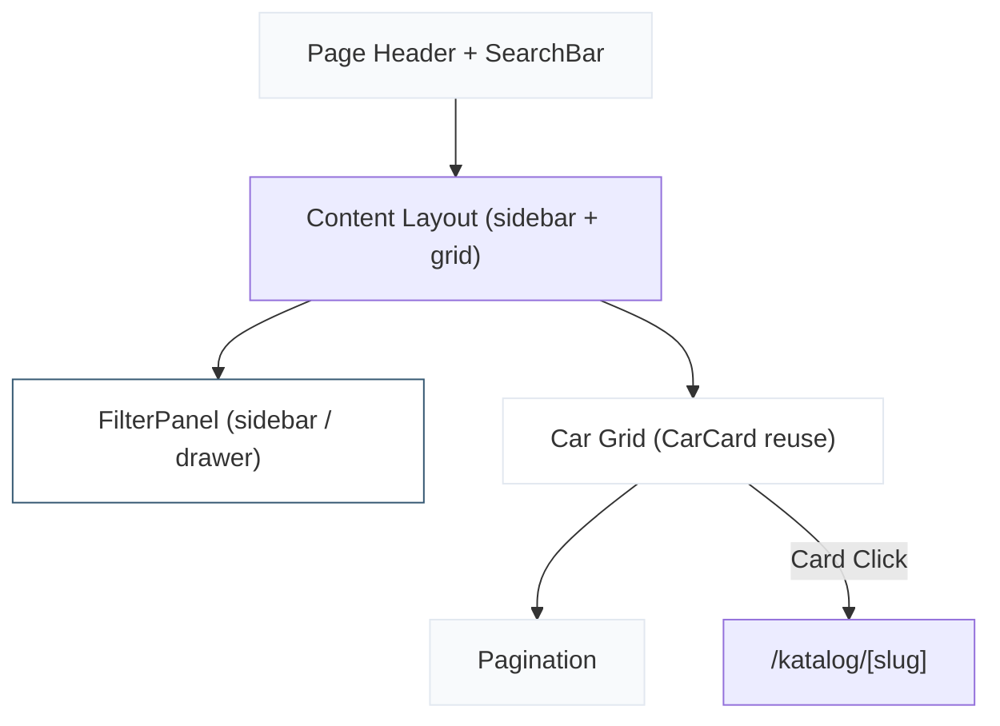

# Implementation Plan — Katalog Page (`/katalog`)

Referensi: [Landing Page Plan](file:///d:/Coding/garasirumahan-laravel1/implementation_plan_frontend_landing_page.md) | [Global Plan](file:///d:/Coding/garasirumahan-laravel1/implementation_plan_frontend_all.md) | [PRD](file:///d:/Coding/garasirumahan-laravel1/PRD.md)

---

## 1. Scope & Overview

Halaman Katalog adalah halaman utama bagi visitor untuk menjelajahi seluruh stok mobil. Halaman ini terdiri dari **header section**, **filter sidebar/drawer**, **car grid**, dan **pagination**.

### Section Flow

```
1. Page Header (judul + search bar + hasil count)
2. Filter Panel (sidebar desktop / drawer mobile) + Car Grid
3. Pagination
```



---

## 2. UI/UX Consistency Rules

> [!IMPORTANT]
> Semua pattern berikut **HARUS** konsisten dengan Landing Page yang sudah dibangun.

### Design Tokens (reuse dari `globals.css`)

| Token | Value | Referensi Landing Page |
|-------|-------|----------------------|
| Container | `max-w-7xl mx-auto px-4 sm:px-6 lg:px-8` | Navbar, Hero, FeaturedCars, Footer |
| Section heading | `text-3xl md:text-4xl font-bold text-slate-900` | FeaturedCars h2, AdvantagesSection h2 |
| Subtitle | `text-lg text-slate-600` | FeaturedCars subtitle |
| Section padding | `py-20` (white bg) / `py-24` (soft-bg) | FeaturedCars / AdvantagesSection |
| Card grid gap | `gap-8` | FeaturedCars grid |
| Animation | `fadeUpVariants` + `staggerContainer` (Framer Motion `Variants`) | FeaturedCars, AdvantagesSection |
| Card hover | `hover:-translate-y-1 hover:shadow-lg hover:border-[var(--color-primary)]/30` | CarCard |
| Primary color ref | `var(--color-primary)` / `text-[var(--color-primary)]` | Global |
| Secondary color ref | `var(--color-secondary)` | CarCard "Lihat Detail" link |
| Icon library | `lucide-react` only (no emoji) | All components |
| `cn()` utility | From `@/lib/utils` | All components |

### Components Reused

| Component | From | Used In |
|-----------|------|---------|
| `CarCard` | `components/public/CarCard.tsx` | Car grid (identical) |
| `Button` | `components/ui/Button.tsx` | Filter actions, mobile filter toggle |
| `Badge` | `components/ui/Badge.tsx` | Active filter pills |
| `Card` | `components/ui/Card.tsx` | Filter panel wrapper |

---

## 3. Files to Create

| # | File | Type | Description |
|---|------|------|-------------|
| 1 | `components/ui/Input.tsx` | UI Component | Reusable text input (search) |
| 2 | `components/ui/Select.tsx` | UI Component | Reusable select dropdown |
| 3 | `components/public/SearchBar.tsx` | Component | Search input with icon |
| 4 | `components/public/FilterPanel.tsx` | Component | Sidebar filters (brand, price, year, transmission) |
| 5 | `components/public/ActiveFilters.tsx` | Component | Active filter badges with clear |
| 6 | `components/public/Pagination.tsx` | Component | Page navigation |
| 7 | `components/public/CatalogHeader.tsx` | Component | Page title + search + count |
| 8 | `app/(public)/katalog/page.tsx` | Page | Katalog page (assembles all) |

---

## 4. Section Detail & Wireframes

### 4.1 Catalog Header

```
Desktop:
┌──────────────────────────────────────────────────────────────────┐
│  bg: #F8FAFC                                                     │
│                                                                  │
│  Katalog Mobil                                                   │
│  Temukan mobil bekas berkualitas dari koleksi kami                │
│                                                                  │
│  ┌──────────────────────────────────────────────────────┐        │
│  │  🔍  Cari mobil berdasarkan nama atau brand...       │        │
│  └──────────────────────────────────────────────────────┘        │
│                                                                  │
│  Menampilkan 6 unit                                              │
│                                                                  │
└──────────────────────────────────────────────────────────────────┘
```

**Specs:**
- Background: `var(--color-soft-bg)` — consistent with Hero & AdvantagesSection
- Padding: `pt-32 pb-12` (account for sticky navbar, same pattern as Hero `pt-32`)
- Heading: `text-3xl md:text-4xl font-bold text-slate-900` — matches FeaturedCars/Advantages
- Subtitle: `text-lg text-slate-600` — matches FeaturedCars subtitle
- Search input: full-width, max-w-xl, icon left (Lucide `Search`), rounded-lg
- Result count: `text-sm text-slate-500`, below search

### 4.2 Filter Panel

```
Desktop (sidebar, left column):
┌─────────────────────┐
│  Filter              │
│  ─────────────────── │
│                      │
│  Brand               │
│  ○ Semua             │
│  ○ Toyota            │
│  ○ Honda             │
│  ○ Mitsubishi        │
│  ○ Daihatsu          │
│  ○ Suzuki            │
│                      │
│  ─────────────────── │
│  Rentang Harga       │
│  [▼ Min] — [▼ Max]   │
│                      │
│  ─────────────────── │
│  Tahun               │
│  [▼ Min] — [▼ Max]   │
│                      │
│  ─────────────────── │
│  Transmisi           │
│  ○ Semua             │
│  ○ Manual            │
│  ○ Automatic         │
│                      │
│  ─────────────────── │
│  [ Reset Filter ]    │
│                      │
└─────────────────────┘

Mobile (slide-out drawer via button):
┌──────────────────────┐
│  [⚙ Filter (2)]     │  ← toggle button, badge shows active count
└──────────────────────┘
        ↓ (drawer open, overlay)
┌──────────────────────┐
│  Filter        [ ✕ ] │
│  ─────────────────── │
│  (same content)      │
│                      │
│  [ Terapkan Filter ] │
└──────────────────────┘
```

**Specs:**
- Desktop: sticky sidebar, `w-64`, `top-28` (navbar height + gap)
- Card wrapper: `bg-white rounded-lg border border-slate-200 shadow-sm p-6` — matches AdvantagesSection cards
- Section dividers: `border-t border-slate-100`
- Labels: `text-sm font-semibold text-slate-900 mb-3`
- Radio/checkbox items: `text-sm text-slate-600`, gap-2
- Selected radio: `text-[var(--color-primary)] font-medium`
- Select dropdowns: reuse `Select` UI component
- Reset button: `Button variant="outline" size="sm"` — reuses existing Button
- Mobile drawer: Framer Motion `AnimatePresence` slide from left — consistent with Navbar mobile menu animation pattern (duration 0.25, ease "easeInOut")
- Mobile toggle: `Button variant="outline"` with `SlidersHorizontal` icon

### 4.3 Car Grid

```
Desktop (3 columns, with sidebar):
┌──────────────┐  ┌──────────────┐  ┌──────────────┐
│   CarCard    │  │   CarCard    │  │   CarCard    │
└──────────────┘  └──────────────┘  └──────────────┘
┌──────────────┐  ┌──────────────┐  ┌──────────────┐
│   CarCard    │  │   CarCard    │  │   CarCard    │
└──────────────┘  └──────────────┘  └──────────────┘

Tablet (2 columns):
┌──────────────┐  ┌──────────────┐
│   CarCard    │  │   CarCard    │
└──────────────┘  └──────────────┘

Mobile (1 column):
┌────────────────────────┐
│       CarCard          │
└────────────────────────┘
```

**Specs:**
- Grid: `grid-cols-1 sm:grid-cols-2 lg:grid-cols-3 gap-8` — identical to FeaturedCars
- Reuses `CarCard` component from landing page (zero modifications)
- Empty state: centered icon + message when no cars match filter
- Animation: same `fadeUpVariants` + `staggerContainer` pattern from FeaturedCars

### 4.4 Active Filters

```
┌──────────────────────────────────────────────────────────────────┐
│  [✕ Toyota]  [✕ Manual]  [✕ 2019-2022]         Hapus Semua     │
└──────────────────────────────────────────────────────────────────┘
```

**Specs:**
- Displayed above grid when any filter is active
- Each pill: `Badge variant="outline"` + `X` icon — reuses Badge component
- "Hapus Semua": text link, `text-sm text-[var(--color-secondary)]` — matches CarCard "Lihat Detail" pattern
- Layout: `flex flex-wrap gap-2 items-center`

### 4.5 Pagination

```
┌──────────────────────────────────────────────────────────────────┐
│              ← Prev   1  [2]  3  ...  5   Next →                │
└──────────────────────────────────────────────────────────────────┘
```

**Specs:**
- Centered, `flex items-center justify-center gap-2`
- Page buttons: `h-10 w-10 rounded-md text-sm font-medium`
- Active page: `bg-[var(--color-primary)] text-white` — matches Button primary
- Inactive: `text-slate-600 hover:bg-slate-100` — matches Button outline hover
- Prev/Next: `Button variant="outline" size="sm"` with `ChevronLeft`/`ChevronRight` icons
- Disabled state: `opacity-50 pointer-events-none`
- Items per page: 6 (configurable constant)

### 4.6 Empty State

```
┌──────────────────────────────────────────────────────────────────┐
│                                                                  │
│                        [Car icon, 64px]                          │
│                                                                  │
│              Tidak ada mobil yang ditemukan                       │
│              Coba ubah filter atau kata kunci pencarian Anda      │
│                                                                  │
│              [ Reset Filter ]                                    │
│                                                                  │
└──────────────────────────────────────────────────────────────────┘
```

**Specs:**
- Icon: `Car` from lucide-react, size 64, `text-slate-300`
- Title: `text-lg font-semibold text-slate-900`
- Subtitle: `text-sm text-slate-500`
- Button: `Button variant="outline"` — reuses existing

---

## 5. Page Layout

```
Desktop (≥1024px):
┌──────────────────────────────────────────────────────────────────┐
│  Navbar (sticky, shared)                                         │
├──────────────────────────────────────────────────────────────────┤
│  CatalogHeader (search + count)                     bg: soft-bg  │
├──────────────────────────────────────────────────────────────────┤
│                                                                  │
│  ┌─────────┐  ┌────────────────────────────────────────────────┐ │
│  │ Filter  │  │  [Active Filters]                              │ │
│  │ Panel   │  │                                                │ │
│  │ (w-64)  │  │  CarCard  CarCard  CarCard                     │ │
│  │ sticky  │  │  CarCard  CarCard  CarCard                     │ │
│  │         │  │                                                │ │
│  │         │  │  [Pagination]                                  │ │
│  └─────────┘  └────────────────────────────────────────────────┘ │
│                                                                  │
├──────────────────────────────────────────────────────────────────┤
│  Footer (shared)                                                 │
└──────────────────────────────────────────────────────────────────┘

Mobile (<1024px):
┌──────────────────────┐
│  Navbar              │
├──────────────────────┤
│  CatalogHeader       │
├──────────────────────┤
│  [⚙ Filter (2)]     │
│  [Active Filters]    │
│                      │
│  CarCard             │
│  CarCard             │
│  CarCard             │
│                      │
│  [Pagination]        │
├──────────────────────┤
│  Footer              │
└──────────────────────┘
```

---

## 6. State Management

Filter dan search state dikelola via **URL search params** (`useSearchParams`) supaya shareable dan bookmarkable.

```
/katalog?search=avanza&brand=Toyota&transmission=Manual&minPrice=100000000&maxPrice=300000000&minYear=2019&maxYear=2023&page=1
```

### Filter Interface

```typescript
interface CatalogFilters {
  search: string;
  brand: string;        // "" = semua
  transmission: string; // "" = semua
  minPrice: string;     // "" = no min
  maxPrice: string;     // "" = no max
  minYear: string;      // "" = no min
  maxYear: string;      // "" = no max
  page: string;         // default "1"
}
```

### Filter Logic (client-side with mock data)

```typescript
// Pseudocode filter pipeline
let filtered = mockCars
  .filter(car => search ? car.name.toLowerCase().includes(search) : true)
  .filter(car => brand ? car.brand === brand : true)
  .filter(car => transmission ? car.transmission === transmission : true)
  .filter(car => minPrice ? car.price >= Number(minPrice) : true)
  .filter(car => maxPrice ? car.price <= Number(maxPrice) : true)
  .filter(car => minYear ? car.year >= Number(minYear) : true)
  .filter(car => maxYear ? car.year <= Number(maxYear) : true);
```

> [!NOTE]
> Saat backend sudah siap, filter akan dikirim sebagai query params ke `GET /api/cars`. Tidak ada perubahan UI, hanya data source yang berubah.

---

## 7. New UI Components Specification

### Input (`components/ui/Input.tsx`)

```typescript
interface InputProps extends React.InputHTMLAttributes<HTMLInputElement> {
  icon?: LucideIcon;    // optional left icon
}
```

**Styling (consistent with Button/Card):**
- Base: `h-10 w-full rounded-md border border-slate-200 bg-white px-3 py-2 text-sm`
- Focus: `focus-visible:ring-2 focus-visible:ring-[var(--color-primary)] focus-visible:ring-offset-2`
- With icon: `pl-10` + icon positioned `absolute left-3 top-1/2 -translate-y-1/2 text-slate-400`

### Select (`components/ui/Select.tsx`)

```typescript
interface SelectProps extends React.SelectHTMLAttributes<HTMLSelectElement> {
  options: { value: string; label: string }[];
}
```

**Styling:** identical border/focus pattern as Input, with `appearance-none` + chevron icon right.

---

## 8. Mock Data Extension

Tambahkan 4 mobil lagi ke `mock-data.ts` (total 10) untuk menguji pagination (6 per page → 2 halaman):

```typescript
// Tambahan mobil #7-#10
{ id: 7, slug: "honda-brio-e-2020", name: "Honda Brio 1.2 E", brand: "Honda", price: 135000000, year: 2020, mileage: 30000, transmission: "Automatic", fuel: "Bensin", ... }
{ id: 8, slug: "toyota-rush-trd-2019", name: "Toyota Rush 1.5 TRD", brand: "Toyota", price: 220000000, year: 2019, mileage: 55000, transmission: "Automatic", fuel: "Bensin", ... }
{ id: 9, slug: "mitsubishi-pajero-dakar-2018", name: "Mitsubishi Pajero Dakar", brand: "Mitsubishi", price: 380000000, year: 2018, mileage: 70000, transmission: "Automatic", fuel: "Diesel", ... }
{ id: 10, slug: "suzuki-xl7-alpha-2021", name: "Suzuki XL7 Alpha", brand: "Suzuki", price: 195000000, year: 2021, mileage: 25000, transmission: "Manual", fuel: "Bensin", ... }
```

---

## 9. Animation Specs

Reuse pattern yang sudah ada dari landing page:

```typescript
// Reuse dari FeaturedCars.tsx / AdvantagesSection.tsx
const fadeUpVariants: Variants = {
  hidden: { opacity: 0, y: 30 },
  visible: { opacity: 1, y: 0, transition: { duration: 0.5, ease: "easeOut" } },
};

const staggerContainer: Variants = {
  hidden: { opacity: 0 },
  visible: { opacity: 1, transition: { staggerChildren: 0.1 } },
};
```

> [!TIP]
> Pertimbangkan untuk extract `fadeUpVariants` dan `staggerContainer` ke file shared (`lib/animations.ts`) agar tidak duplikasi di setiap file. Ini akan dilakukan saat implementasi.

### Mobile Filter Drawer

```typescript
// Consistent with Navbar mobile menu
initial={{ x: "-100%" }}
animate={{ x: 0 }}
exit={{ x: "-100%" }}
transition={{ duration: 0.25, ease: "easeInOut" }}
```

---

## 10. Responsive Behavior

| Section | Mobile (<640px) | Tablet (768px) | Desktop (≥1024px) |
|---------|----------------|----------------|-------------------|
| **Header** | Stack, search full-width | Same | Centered, search max-w-xl |
| **Filter** | Hidden → drawer toggle | Hidden → drawer toggle | Sidebar w-64 sticky |
| **Grid** | 1 column | 2 columns | 3 columns |
| **Active Filters** | Horizontal scroll | Wrap | Wrap |
| **Pagination** | Compact (prev/next only) | Full numbered | Full numbered |

---

## 11. SEO & Metadata

```typescript
export const metadata: Metadata = {
  title: "Katalog Mobil - Garasirumahan",
  description: "Jelajahi koleksi mobil bekas berkualitas di Garasirumahan. Filter berdasarkan brand, harga, tahun, dan transmisi.",
};
```

- `<h1>`: "Katalog Mobil" (satu per halaman)
- Heading hierarchy: h1 → h2 (tidak ada h2 di katalog, langsung h3 pada card)
- Semantic HTML: `<section>`, `<aside>` (filter), `<nav>` (pagination)
- `aria-label` pada filter drawer dan pagination

---

## 12. Verification Plan

### Browser Tests
- Buka `/katalog` di `localhost:3000`
- Verifikasi semua mobil muncul di grid
- Test search: ketik "avanza" → hanya Toyota Avanza muncul
- Test filter brand: pilih "Honda" → hanya Honda muncul
- Test filter transmisi: pilih "Automatic" → filter benar
- Test filter range harga: set min 150jt max 250jt
- Test kombinasi filter
- Test reset filter → semua mobil kembali
- Test pagination (page 1 → page 2)
- Test empty state (filter yang tidak match)
- Test mobile drawer filter open/close
- Verifikasi no horizontal scroll di mobile
- Test responsive di 375px, 768px, 1024px, 1440px

### Quality Checks
- CarCard identik dengan landing page (no divergence)
- Warna, font, spacing konsisten dengan landing page
- Semua interactive elements punya `cursor-pointer`
- Hover states smooth (150–300ms transition)
- `prefers-reduced-motion` respected
- Semantic HTML elements digunakan
- No emoji as icons
