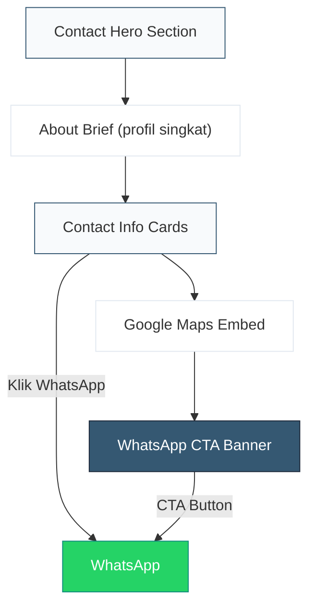

# Implementation Plan — Halaman Kontak (`/kontak`)

Referensi: [Global Plan](file:///f:/Coding/Showroom-mobil-laravel/implementation_plan_frontend_all.md) | [Katalog Plan](file:///f:/Coding/Showroom-mobil-laravel/implementation_plan_katalog.md) | [PRD](file:///f:/Coding/Showroom-mobil-laravel/PRD.md)

---

## 1. Scope & Overview

Halaman **Kontak** adalah satu-satunya halaman informasi non-katalog. Halaman ini menggabungkan **profil singkat showroom** + **informasi kontak lengkap** + **Google Maps embed** dalam satu halaman yang kompak dan profesional.

> [!IMPORTANT]
> Halaman **Tentang Kami (`/tentang`)** dihapus dari navigasi. Profil singkat showroom ditampilkan sebagai section pertama di halaman Kontak ini.

### Keputusan Arsitektur

| Keputusan | Detail |
|-----------|--------|
| Hapus `/tentang` | Profil singkat → ditampilkan di halaman Kontak |
| Navbar update | Menu: Beranda, Katalog, **Kontak** (3 item saja) |
| Footer update | Link "Tentang Kami" dihapus dari navigasi footer |
| Tidak membuat folder `tentang/` | Folder route `tentang/` tidak dibuat |

### Section Flow

```
1. Contact Hero (judul + subtitle singkat)
2. About Brief (profil singkat showroom + value propositions)
3. Contact Info Cards (WhatsApp, Alamat, Jam Operasional)
4. Google Maps Embed
5. WhatsApp CTA Banner (reuse existing component)
```



---

## 2. UI/UX Consistency Rules

> [!IMPORTANT]
> Semua pattern berikut **HARUS** konsisten dengan Landing Page dan Katalog yang sudah dibangun.

### Design Tokens (reuse dari `globals.css`)

| Token | Value | Referensi |
|-------|-------|-----------|
| Container | `max-w-7xl mx-auto px-4 sm:px-6 lg:px-8` | Semua page |
| Section heading | `text-3xl md:text-4xl font-bold text-slate-900` | FeaturedCars, AdvantagesSection |
| Subtitle | `text-lg text-slate-600` | FeaturedCars subtitle |
| Section padding (white bg) | `py-20` | FeaturedCars |
| Section padding (soft-bg) | `py-24` | AdvantagesSection |
| Card style | `Card` component with `hover:shadow-md hover:border-[var(--color-secondary)]` | AdvantagesSection cards |
| Animation | `fadeUpVariants` + `staggerContainer` dari `@/lib/animations` | Semua section |
| Primary color ref | `var(--color-primary)` | Global |
| Secondary color ref | `var(--color-secondary)` | Global |
| Icon library | `lucide-react` only (no emoji) | All components |
| `cn()` utility | From `@/lib/utils` | All components |

### Components Reused

| Component | From | Used In |
|-----------|------|---------|
| `WhatsAppCTA` | `components/public/WhatsAppCTA.tsx` | CTA banner (bottom section) |
| `Card` | `components/ui/Card.tsx` | Contact info cards, about cards |
| `Button` | `components/ui/Button.tsx` | WhatsApp button in contact info |

---

## 3. Proposed Changes

### [NEW] `app/(public)/kontak/page.tsx`

File halaman utama Kontak yang meng-assemble semua section.

```typescript
// Metadata
export const metadata: Metadata = {
  title: "Kontak - Garasirumahan",
  description: "Hubungi Garasirumahan untuk informasi mobil bekas berkualitas. Kunjungi showroom kami atau hubungi via WhatsApp.",
};
```

**Sections yang di-render:**
1. `ContactHero`
2. `AboutBrief`
3. `ContactInfoSection`
4. `MapsSection`
5. `WhatsAppCTA` (reuse)

---

### [NEW] `components/public/ContactHero.tsx`

Hero section khusus halaman Kontak.

```
┌──────────────────────────────────────────────────────────────────┐
│  bg: var(--color-soft-bg)                                        │
│                                                                  │
│                     Hubungi Kami                    ← h1         │
│       Kami siap membantu Anda menemukan             ← subtitle  │
│       mobil bekas berkualitas impian Anda                        │
│                                                                  │
└──────────────────────────────────────────────────────────────────┘
```

**Specs:**
- Background: `var(--color-soft-bg)` — konsisten dengan CatalogHeader
- Padding: `pt-32 pb-16` (account for sticky navbar, same as CatalogHeader `pt-32`)
- `<h1>`: `text-3xl md:text-4xl font-bold text-slate-900` — matches semua heading
- Subtitle: `text-lg text-slate-600 max-w-2xl mx-auto` — centered
- Animation: `fadeUpVariants` — single block, no stagger
- Text alignment: `text-center`

---

### [NEW] `components/public/AboutBrief.tsx`

Profil singkat showroom sebagai pengganti halaman Tentang.

```
Desktop:
┌──────────────────────────────────────────────────────────────────┐
│  bg: white                                                       │
│                                                                  │
│           Tentang Garasirumahan                     ← h2        │
│   Showroom mobil bekas terpercaya yang              ← paragraph │
│   mengutamakan kualitas, transparansi,                          │
│   dan kepuasan pelanggan.                                       │
│                                                                  │
│  ┌──────────────┐  ┌──────────────┐  ┌──────────────┐           │
│  │  Unit         │  │  Harga       │  │  Proses      │           │
│  │  Terjamin     │  │  Jujur       │  │  Mudah       │           │
│  │              │  │              │  │              │           │
│  │ Deskripsi... │  │ Deskripsi... │  │ Deskripsi... │           │
│  └──────────────┘  └──────────────┘  └──────────────┘           │
│                                                                  │
└──────────────────────────────────────────────────────────────────┘
```

**Specs:**
- Background: `bg-white` — section putih
- Padding: `py-20`
- Section heading: `text-3xl md:text-4xl font-bold text-slate-900 mb-4` — centered
- Paragraph: `text-lg text-slate-600 max-w-3xl mx-auto mb-12 leading-relaxed` — centered
- Value proposition cards: **3 buah**, grid `grid-cols-1 sm:grid-cols-3 gap-6`
- Setiap card: reuse `Card` component + icon pattern identik dari `AdvantagesSection` (icon box `h-14 w-14 rounded-xl bg-[var(--color-primary)]/10 text-[var(--color-primary)]`)
- Animation: `fadeUpVariants` pada heading, `staggerContainer` + `fadeUpVariants` pada grid cards
- Data: hardcoded (mirip `AdvantagesSection`) — 3 keunggulan utama:
  1. **Unit Terjamin** — `ShieldCheck` icon
  2. **Harga Jujur** — `BadgeDollarSign` icon
  3. **Proses Mudah** — `Handshake` icon

> [!NOTE]
> Konten value proposition ini BERBEDA dari `AdvantagesSection` di landing page. Landing page punya 4 item, di sini hanya 3 item ringkas yang fokus pada "mengapa menghubungi kami".

---

### [NEW] `components/public/ContactInfoSection.tsx`

Cards berisi informasi kontak lengkap.

```
Desktop:
┌──────────────────────────────────────────────────────────────────┐
│  bg: var(--color-soft-bg)                                        │
│                                                                  │
│  ┌──────────────────────┐  ┌──────────────────────┐              │
│  │  WhatsApp             │  │  Alamat               │              │
│  │                       │  │                       │              │
│  │  +6281234567890       │  │  Jl. Otomotif No. 123 │              │
│  │                       │  │  Jakarta Selatan      │              │
│  │  [ Chat Sekarang → ] │  │                       │              │
│  └──────────────────────┘  └──────────────────────┘              │
│                                                                  │
│  ┌──────────────────────┐  ┌──────────────────────┐              │
│  │  Jam Operasional      │  │  Follow Us            │              │
│  │                       │  │                       │              │
│  │  Senin - Sabtu        │  │  Instagram / Facebook │              │
│  │  08:00 - 17:00        │  │  (optional, jika ada) │              │
│  └──────────────────────┘  └──────────────────────┘              │
│                                                                  │
└──────────────────────────────────────────────────────────────────┘
```

**Specs:**
- Background: `var(--color-soft-bg)` — konsisten dengan alternate section pattern
- Padding: `py-24`
- Section heading: `text-3xl md:text-4xl font-bold text-slate-900 mb-4` — centered
- Subtitle: `text-lg text-slate-600 mb-12` — centered
- Grid: `grid-cols-1 sm:grid-cols-2 gap-6`
- Setiap card:
  - Wrapper: `Card` component, `p-8`
  - Icon container: `h-14 w-14 rounded-xl bg-[var(--color-primary)]/10 text-[var(--color-primary)] mb-4`
  - Label: `text-lg font-semibold text-slate-900 mb-2`
  - Value: `text-slate-600 leading-relaxed`
  - Hover: `hover:shadow-md hover:border-[var(--color-secondary)] hover:-translate-y-1 transition-all duration-300` — identik dengan AdvantagesSection
- WhatsApp card: tambahan `Button variant="whatsapp" size="sm"` di bawah nomor telepon
- Icons (Lucide):
  - WhatsApp: `MessageCircle`
  - Alamat: `MapPin`
  - Jam: `Clock`
  - Social: `Instagram` (atau `Globe` jika tidak ada)
- Data: dari `mockSettings` (sudah tersedia di `mock-data.ts`)
- Animation: `staggerContainer` + `fadeUpVariants`

---

### [NEW] `components/public/MapsSection.tsx`

Google Maps embed section.

```
┌──────────────────────────────────────────────────────────────────┐
│  bg: white                                                       │
│                                                                  │
│       Lokasi Kami                                    ← h2       │
│       Kunjungi showroom kami secara langsung         ← subtitle │
│                                                                  │
│  ┌──────────────────────────────────────────────────────────────┐│
│  │                                                              ││
│  │                   GOOGLE MAPS EMBED                          ││
│  │                   (iframe, 100% width)                       ││
│  │                   height: 400px desktop                      ││
│  │                   height: 300px mobile                       ││
│  │                                                              ││
│  └──────────────────────────────────────────────────────────────┘│
│                                                                  │
└──────────────────────────────────────────────────────────────────┘
```

**Specs:**
- Background: `bg-white`
- Padding: `py-20`
- Section heading: centered, same pattern
- Maps iframe:
  - `width: 100%`
  - Desktop: `h-[400px]`, Mobile: `h-[300px]`
  - `rounded-xl border border-slate-200 shadow-sm`
  - `loading="lazy"` — untuk performa
  - `allowFullScreen`
  - Placeholder URL: Google Maps embed URL (hardcoded untuk mockup, nanti bisa dinamis dari settings)
- Animation: `fadeUpVariants` pada wrapper

> [!TIP]
> Saat backend siap, embed URL bisa ditambahkan ke `Settings` model sebagai field `maps_embed_url`. Untuk sekarang, hardcode URL contoh.

---

### [MODIFY] `components/public/Navbar.tsx`

Update array `navLinks` untuk menghapus menu "Tentang".

```diff
 const navLinks = [
   { href: "/", label: "Beranda" },
   { href: "/katalog", label: "Katalog" },
-  { href: "/tentang", label: "Tentang" },
   { href: "/kontak", label: "Kontak" },
 ];
```

---

### [MODIFY] `components/public/Footer.tsx`

Hapus link "Tentang Kami" dari navigasi footer.

```diff
 <ul className="space-y-4">
   <li>
     <Link href="/" ...>Beranda</Link>
   </li>
   <li>
     <Link href="/katalog" ...>Katalog Mobil</Link>
   </li>
-  <li>
-    <Link href="/tentang" ...>Tentang Kami</Link>
-  </li>
   <li>
     <Link href="/kontak" ...>Hubungi Kami</Link>
   </li>
 </ul>
```

---

## 4. Page Layout

```
Desktop (≥1024px):
┌──────────────────────────────────────────────────────────────────┐
│  Navbar (sticky, shared)                                         │
├──────────────────────────────────────────────────────────────────┤
│  ContactHero (h1 + subtitle)                        bg: soft-bg  │
├──────────────────────────────────────────────────────────────────┤
│  AboutBrief (profil + 3 value cards)                bg: white    │
├──────────────────────────────────────────────────────────────────┤
│  ContactInfoSection (4 info cards grid)             bg: soft-bg  │
├──────────────────────────────────────────────────────────────────┤
│  MapsSection (Google Maps embed)                    bg: white    │
├──────────────────────────────────────────────────────────────────┤
│  WhatsAppCTA (reuse, gradient banner)               bg: gradient │
├──────────────────────────────────────────────────────────────────┤
│  Footer (shared)                                                 │
└──────────────────────────────────────────────────────────────────┘

Mobile (<640px):
┌──────────────────────┐
│  Navbar              │
├──────────────────────┤
│  ContactHero         │
├──────────────────────┤
│  AboutBrief          │
│  (cards stack 1 col) │
├──────────────────────┤
│  ContactInfoSection  │
│  (cards stack 1 col) │
├──────────────────────┤
│  MapsSection         │
│  (h-[300px])         │
├──────────────────────┤
│  WhatsAppCTA         │
├──────────────────────┤
│  Footer              │
└──────────────────────┘
```

---

## 5. Files Summary

| # | File | Type | Action |
|---|------|------|--------|
| 1 | `app/(public)/kontak/page.tsx` | Page | **NEW** |
| 2 | `components/public/ContactHero.tsx` | Component | **NEW** |
| 3 | `components/public/AboutBrief.tsx` | Component | **NEW** |
| 4 | `components/public/ContactInfoSection.tsx` | Component | **NEW** |
| 5 | `components/public/MapsSection.tsx` | Component | **NEW** |
| 6 | `components/public/Navbar.tsx` | Component | **MODIFY** (hapus "Tentang") |
| 7 | `components/public/Footer.tsx` | Component | **MODIFY** (hapus link "Tentang Kami") |

---

## 6. Responsive Behavior

| Section | Mobile (<640px) | Tablet (768px) | Desktop (≥1024px) |
|---------|----------------|----------------|-------------------|
| **ContactHero** | `pt-28 pb-12`, heading `text-2xl` | Same as mobile | `pt-32 pb-16`, heading `text-4xl` |
| **AboutBrief** | Cards 1 column stack | Cards 3 columns | Cards 3 columns |
| **ContactInfoSection** | Cards 1 column stack | Cards 2 columns | Cards 2 columns |
| **MapsSection** | `h-[300px]` | `h-[350px]` | `h-[400px]` |
| **WhatsAppCTA** | Button full-width | Button auto | Button auto |

---

## 7. Animation Specs

Reuse semua pattern dari landing page:

```typescript
// Dari @/lib/animations.ts (sudah ada)
import { fadeUpVariants, staggerContainer } from "@/lib/animations";
```

| Section | Animation | Trigger |
|---------|-----------|---------|
| ContactHero | `fadeUpVariants` | `whileInView`, once |
| AboutBrief heading | `fadeUpVariants` | `whileInView`, once |
| AboutBrief cards | `staggerContainer` + `fadeUpVariants` | `whileInView`, once |
| ContactInfo heading | `fadeUpVariants` | `whileInView`, once |
| ContactInfo cards | `staggerContainer` + `fadeUpVariants` | `whileInView`, once |
| MapsSection | `fadeUpVariants` | `whileInView`, once |
| WhatsAppCTA | Already animated (reuse) | Existing |

---

## 8. SEO & Metadata

```typescript
export const metadata: Metadata = {
  title: "Kontak - Garasirumahan",
  description: "Hubungi Garasirumahan untuk informasi mobil bekas berkualitas. Kunjungi showroom kami atau hubungi via WhatsApp.",
};
```

- `<h1>`: "Hubungi Kami" (satu per halaman)
- `<h2>`: "Tentang Garasirumahan", "Informasi Kontak", "Lokasi Kami"
- Semantic HTML: `<section>` per section, `<address>` untuk informasi kontak, `<iframe>` untuk maps
- Google Maps: `loading="lazy"` untuk performa
- `aria-label` pada interactive elements

---

## 9. Mock Data

Semua data kontak sudah tersedia di `mockSettings` ([mock-data.ts](file:///f:/Coding/Showroom-mobil-laravel/frontend/src/lib/mock-data.ts)):

```typescript
// Sudah ada, tidak perlu modifikasi
export const mockSettings: Settings = {
  showroom_name: "Garasirumahan",
  phone: "6281234567890",
  address: "Jl. Otomotif No. 123, Jakarta Selatan",
  open_hours: "Senin - Sabtu, 08:00 - 17:00",
  meta_title: "Garasirumahan - Showroom Mobil Bekas Terpercaya",
  meta_description: "...",
};
```

> [!NOTE]
> Tidak perlu menambah data baru ke `mock-data.ts`. Cukup import `mockSettings`.

---

## 10. Verification Plan

### Browser Tests
- Buka `/kontak` di `localhost:3000`
- Verifikasi hero section muncul dengan heading dan subtitle
- Verifikasi section profil singkat + 3 value cards
- Verifikasi 4 contact info cards (WhatsApp, Alamat, Jam, Social)
- Verifikasi tombol WhatsApp di card membuka link `wa.me` dengan benar
- Verifikasi Google Maps embed ter-render dan bisa diinteraksi
- Verifikasi WhatsAppCTA banner di bagian bawah
- Test responsive di 375px, 768px, 1024px, 1440px
- Verifikasi Navbar hanya menampilkan 3 menu: Beranda, Katalog, Kontak
- Verifikasi Footer tidak menampilkan link "Tentang Kami"
- Verifikasi no horizontal scroll di mobile

### Quality Checks
- Warna, font, spacing konsisten dengan landing page & katalog
- Scroll animations (fade up) berjalan smooth
- Semua interactive elements punya `cursor-pointer`
- Hover states pada cards smooth (transition 300ms)
- `prefers-reduced-motion` respected
- Semantic HTML elements digunakan
- No emoji as icons (lucide-react only)
